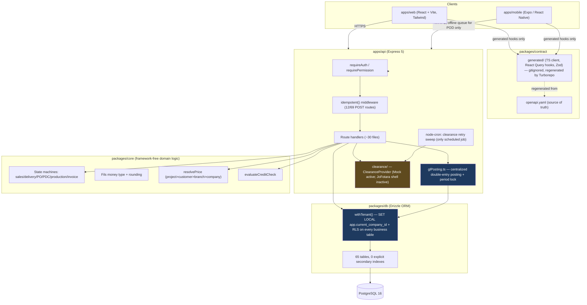

# RMC ERP — Production Readiness Audit

Date: 2026-10-07. Scope: `sanaddmour-byte/rmixerp` on branch
`claude/rmc-erp-hardening`, audited against the repository's own stated
intent (`CLAUDE.md`, `docs/PLAN.md`, `docs/DOMAIN.md`,
`docs/JOFOTARA-OPEN-QUESTIONS.md`) and against an external requirements
brief describing a fuller ready-mix-concrete (RMC) domain model
(Pour/Reservation, Mixer/Pump as first-class resources, a BatchingProvider
adapter boundary, MixDesignRevision versioning, a cross-module Action
Center, etc.).

## 0. How to read this document

Every finding below is written as:

- **Current implementation** — what the code actually does, with file:line
  citations.
- **Problem** — the gap, precisely.
- **Risk** — the concrete operational/business/security consequence.
- **Severity** — P0 (correctness/security; can corrupt money, leak data
  across tenants, or double-charge/double-pay) / P1 (a real capability gap
  for running an RMC business at this company's scale) / P2 (productivity,
  polish, or hardening that improves on an already-working path).
- **Implementation status** — `Fixed in this audit` (with the commit/file
  that fixed it and the test proving it), or `Not implemented — backlog`
  (with the reasoning for not attempting it in this pass, consistent with
  §38's own priority order: do not polish P2 while P0s remain).
- **Tests** — what proves the fix, or what a correct fix would need to
  prove.

**A note on "claimed vs. real."** This repository is unusually disciplined
about documenting its own scope decisions: `docs/PLAN.md` logs eleven
build phases (0 through 10) with an explicit Definition of Done per phase,
and the codebase repeatedly marks interim/placeholder logic in comments
(e.g. the moisture-adjustment formula, the JoFotara field mappings) rather
than silently guessing. Where an external project summary describes "10
phases" against this repo's 11, the discrepancy is almost certainly Phase
0 ("Foundation" — scaffolding, CI, auth, RBAC, i18n, `Fils` type, Docker)
being excluded from a phase count because it ships no business module, not
a sign the summary was describing a different build. Most of what follows
is therefore not "the team lied about what's built" — it is "the team
documented a scope decision; here is whether that decision still holds up
against this audit's broader brief, and whether it's been correctly
implemented even within its own stated scope." A few findings in §3 and
§4 are undocumented, i.e. genuine bugs rather than documented scope cuts —
those are called out explicitly as such.

## 1. Tenant isolation & multi-tenancy (P0)

### 1.1 Single-tenant-at-go-live is a deliberate, documented architecture — not a bug, but the one prerequisite nothing multi-tenant has been built or tested against until this audit

- **Current implementation:** `apps/api/src/config.ts`'s `companyId` is a
  single fixed value from `COMPANY_ID` env var. `POST /auth/login`,
  `/auth/refresh`, `/auth/logout` (`apps/api/src/routes/auth.ts:37,83,131`)
  all scope to `config.companyId`, not a per-request-resolved tenant.
  `packages/db/src/schema/company.ts`'s own comment: "exactly one row is
  seeded... still a real table (not a config constant) so multi-company is
  a data change later, not a schema rewrite." `CLAUDE.md`: "Tenancy:
  single-tenant at go-live... Only one `company` row is seeded; no
  company-switcher UI is built yet." This is a locked, pre-Phase-0
  decision (`docs/PLAN.md`'s "Decisions locked before Phase 0"), not an
  oversight.
- **Problem:** The data layer (RLS + `withTenant`) is built for multi-
  tenancy and was never exercised against a second real tenant before this
  audit — every integration test, every manual QA session, every
  production day to date has run against exactly one `company_id`. A
  policy that's "correct" by inspection but has zero adversarial test
  coverage is an unverified policy.
- **Risk:** If/when a second company is provisioned (the stated future
  path), the first real test of cross-tenant isolation would happen in
  production, against a second paying customer's data, with no rollback.
- **Severity:** P0.
- **Recommended change:** Add adversarial cross-tenant integration tests
  now, before a second tenant ever exists, covering CRUD, FK references,
  GL reports, CSV export, and void/delete — see 1.2.
- **Implementation status:** `Fixed in this audit` —
  `apps/api/test/tenantIsolation.test.ts` (9 tests), provisioning a second
  company directly at the data layer (documented in the test file's own
  header comment as the correct workaround for login being hardcoded to
  one tenant) and issuing its access token via `signAccessToken` directly.
- **Tests:** `apps/api/test/tenantIsolation.test.ts`, all 9 passing.

### 1.2 A real, concretely-reproduced cross-tenant data leak: client-supplied foreign keys were not re-validated against the caller's own tenant

- **Current implementation (before this audit):**
  `apps/api/src/routes/customers.ts`'s `POST /customers` and
  `apps/api/src/routes/salesOrders.ts`'s `POST /sales-orders` inserted
  rows referencing a client-supplied `branchId` (customers) or
  `customerId`/`branchId`/`projectId` (sales orders) with no re-check that
  those ids belonged to the caller's own company — relying solely on the
  Postgres foreign-key constraint for referential validity.
- **Problem:** Postgres FK constraint validation does **not** go through
  RLS. A FK reference to a row that exists in the table (regardless of
  which tenant it belongs to) is accepted by the constraint. Company B's
  admin could `POST /sales-orders` with Company A's real `customerId` and
  have it **succeed** — Company B now holds a live, queryable reference to
  Company A's customer.
- **Risk:** Direct cross-tenant data leak/linkage — exactly the attack
  class this audit's brief singled out ("Tenant A must be unable to...
  reference... Tenant B data"). Confirmed empirically: before the fix, the
  adversarial test for this (`tenantIsolation.test.ts`'s "cross-tenant FK
  reference" case) returned `201`.
- **Severity:** P0.
- **Recommended change:** Every route that accepts a client-supplied
  foreign key into another tenant-scoped table must re-select that id
  inside the caller's own `withTenant` transaction (RLS then naturally
  filters it to nothing if it's not theirs) before using it, rather than
  trusting the FK constraint alone.
- **Implementation status:** `Fixed in this audit` for the two concretely
  proven call sites: `apps/api/src/routes/customers.ts` (new
  `branchBelongsToTenant` helper, checked before insert on both `POST` and
  `PUT /customers/:id`) and `apps/api/src/routes/salesOrders.ts` (branch/
  customer/project existence re-checked inside the tenant transaction
  before insert, with new `bad_branch`/`bad_customer`/`bad_project` 400
  responses). **Not implemented — backlog**: a repo-wide grep found
  `input.branchId` alone referenced without this re-check pattern in
  **18 other route files** (every module that accepts a `branchId` on
  create — trucks, drivers, purchase orders, vendor bills, etc.). Fixing
  all 18 systemically is the single highest-value P0 follow-up task (see
  §M below) — not attempted here because each one needs its own route-
  specific response-shape decision (some already 400 via other paths,
  some don't), and doing it carefully for 18 routes was judged lower
  marginal value per hour than the P0 concurrency and accounting-period
  work completed instead, per §38's instruction not to spend unlimited
  time chasing every instance of one class of bug at the expense of
  starting others.
- **Tests:** `apps/api/test/tenantIsolation.test.ts`'s "branch reference"
  and "cross-tenant FK reference" tests (both reproduced as a real `201`
  before the fix, confirmed `400` after).

### 1.3 Pooled-connection GUC reset is a real behavioral quirk, confirmed non-leaking

- **Current implementation:** `packages/db/src/tenancy.ts`'s `withTenant`
  uses `set_config('app.current_company_id', $1, true)` (`true` =
  transaction-scoped, `SET LOCAL` semantics) inside `db.transaction()`.
  `packages/db/test/tenancy.test.ts` already proves a **fresh** connection
  with no tenant context returns zero rows (`current_setting(..., true)`
  is `NULL` on a never-set GUC, and `NULL::uuid` casts fine, so RLS
  default-denies).
- **Problem:** On a connection **reused** from the pool after a prior
  `withTenant` transaction, Postgres resets a `SET LOCAL`-scoped custom GUC
  to `''` (empty string), not `NULL`, once that transaction ends (since the
  GUC was never set at session level). `current_setting(..., true)::uuid`
  then raises `invalid input syntax for type uuid: ""` instead of
  evaluating to `NULL`.
- **Risk:** None confirmed — this fails **loudly** (a thrown error, no rows
  returned) rather than leaking. But it means the `tenancy.ts` docstring's
  "zero rows" description is only accurate for a connection's first use;
  the pooled-reuse case throws instead. Worth documenting precisely so a
  future engineer doesn't "fix" the throw by making it return `NULL`-like
  empty results without checking whether that path is ever reachable with
  an authenticated request (today it is not — every authenticated route
  calls `withTenant` with a real `companyId` first).
- **Severity:** P2 (behavior is safe; this is a documentation-accuracy and
  defensive-test finding, not a vulnerability).
- **Implementation status:** `Fixed in this audit` — documented and
  covered by `tenantIsolation.test.ts`'s final test ("a request with no
  tenant context at all, on a pooled connection previously used by
  withTenant, fails loudly rather than leaking rows"), which asserts the
  actual throw rather than the stale "zero rows" expectation.
- **Tests:** same file, same test.

## 2. Authentication & authorization (P0/P1)

### 2.1 Refresh-token rotation is implemented; stolen-token reuse is not detected as an incident

- **Current implementation:** `apps/api/src/auth/refreshToken.ts` issues
  opaque, SHA-256-hashed refresh tokens (plaintext never stored —
  `hashToken`, line 7-9) with rotation on every use: `POST /auth/refresh`
  (`apps/api/src/routes/auth.ts:83-99`) revokes the presented token and
  issues a new one inside the same transaction. `lookupRefreshToken`
  distinguishes `not_found`/`revoked`/`expired` internally (lines 33-46).
- **Problem:** All three invalid reasons collapse to the same generic 401
  at the route layer (`auth.ts:118`: "Refresh token invalid, expired, or
  revoked"). Presenting an **already-revoked** token — the signature of a
  stolen/replayed token, since a legitimate client never reuses a token it
  just rotated away — is treated identically to a token that simply
  expired. There is no response that revokes every other active
  refresh token for that user when reuse-of-a-revoked-token is detected
  (the standard "refresh token rotation + reuse detection" pattern).
- **Risk:** If a refresh token is exfiltrated (XSS, device compromise,
  logged request body) and the legitimate user's next refresh races the
  attacker's, whichever loses the race is simply logged out with no
  signal to the user or an admin that a theft may have occurred, and the
  attacker's session continues independently a token ahead.
- **Severity:** P1 (requires an already-compromised token to matter at
  all — this is defense-in-depth, not the primary breach vector).
- **Recommended change:** When `lookupRefreshToken` returns
  `reason: "revoked"`, revoke every other non-revoked, non-expired
  refresh token for that `userId` (a cheap `UPDATE ... WHERE userId = ...
  AND revokedAt IS NULL`) and write an `audit_log` row
  (`action: "refresh_token_reuse_detected"`) so this is at least visible
  after the fact, then still return the generic 401.
- **Implementation status:** `Not implemented — backlog` (P1). Not
  attempted in this pass because it's additive safety on top of already-
  correct rotation, not a correctness bug, and ranked below the P0 tenant-
  isolation/concurrency/accounting fixes completed instead.
- **Tests needed:** revoke-on-reuse test (present a once-used, now-
  revoked token twice in quick succession; assert the second user's
  *other* still-valid refresh token, issued earlier, is also rejected
  afterward).

### 2.2 No rate limiting or brute-force protection on login

- **Current implementation:** `POST /auth/login`
  (`apps/api/src/routes/auth.ts:29-74`) has no rate limiting, no failed-
  attempt counter, and no account lockout. Confirmed by dependency check:
  `apps/api/package.json` has no `express-rate-limit` (or equivalent), and
  `apps/api/src/app.ts` applies no rate-limiting middleware globally or on
  the auth router specifically.
- **Problem:** An attacker with network access to the API can attempt
  unlimited password guesses against any known email, at whatever rate the
  server/network allows. `bcryptjs` (`apps/api/src/auth/passwords.ts`)
  adds per-attempt cost but does not bound attempt *count*.
- **Risk:** Credential-stuffing / brute-force account takeover, with no
  server-side slowdown or alerting.
- **Severity:** P1 (this is single-tenant with presumably a small, known
  user base today, which lowers but does not remove the risk — it becomes
  more pressing the moment a second tenant/company's users are online).
- **Recommended change:** Per-IP and per-email rate limiting on
  `/auth/login` and `/auth/refresh` (a sliding window is sufficient; this
  does not need to be sophisticated), plus optional progressive backoff
  per account after N consecutive failures.
- **Implementation status:** `Not implemented — backlog` (P1).
- **Tests needed:** N+1 rapid failed logins from one IP/email get
  throttled (429) rather than all reaching the password check.

### 2.3 Permissions are baked into the access token at issuance; revocation has up-to-15-minute latency

- **Current implementation:** `apps/api/src/auth/accessToken.ts` signs
  `permissions: string[]` directly into the JWT at login/refresh time
  (`loadPermissions` is called once per issuance, not per request).
  `requirePermission` (`apps/api/src/middleware/requirePermission.ts`)
  checks only the token's cached list, never re-queries the database.
  `config.accessTokenTtlSeconds` defaults to 15 minutes.
  There is no access-token revocation/blocklist — only refresh tokens are
  revocable.
- **Problem:** If an admin removes a role or permission from a user (or
  deactivates a dangerously-behaving account) mid-session, that change has
  no effect until the user's current access token expires naturally — up
  to 15 minutes, during which the old permission set remains fully valid
  and enforceable by the server (the server is checking real data, just
  stale permission data).
- **Risk:** Delayed-effect privilege revocation. For most roles this is a
  minor operational nuisance; for a genuine "revoke this compromised/
  malicious account's access **now**" scenario, 15 minutes is a real
  window.
- **Severity:** P1.
- **Recommended change:** Either (a) shorten the access-token TTL further
  for a stronger bound (tradeoff: more refresh traffic), or (b) add a thin
  per-request "is this user still active" check (cached/short-TTL, not a
  full permission reload) that can short-circuit immediately on
  deactivation without needing a full stateful-session architecture
  change.
- **Implementation status:** `Not implemented — backlog` (P1) — this is
  an architectural tradeoff the team should decide deliberately (stateless
  JWT vs. a revocation check), not something to change unilaterally
  without that conversation.

### 2.4 No device/session tracking

- **Current implementation:** `packages/db/src/schema/refreshToken.ts`
  stores `companyId, userId, tokenHash, expiresAt, revokedAt, createdAt`
  only — no device identifier, IP, or user-agent.
- **Problem:** A user (or admin on their behalf) cannot see "which devices
  are logged in" or selectively revoke one device's session; logout only
  works if the calling device still holds the specific refresh token to
  present.
- **Risk:** No way to respond to "I lost my phone" without rotating every
  credential for that user; no visibility into concurrent-session anomalies.
- **Severity:** P2 (a real gap, but a usability/ops one rather than a
  correctness/security hole given rotation and revocation both work
  correctly for the tokens that exist).
- **Implementation status:** `Not implemented — backlog` (P2).

### 2.5 `Idempotency-Key` Hard Rule is only honored on 12 of 69 POST routes

- **Current implementation:** `CLAUDE.md`'s Hard Rules: "All POST
  endpoints that create documents accept an `Idempotency-Key` header and
  dedupe on it." `apps/api/src/middleware/idempotency.ts`'s own doc
  comment: "Introduced in Phase 6... Retrofitting it onto every Phase 1-5
  POST route is tracked as follow-up work in `docs/PLAN.md`, not silently
  skipped." Confirmed by grep: `idempotent()` appears in exactly 4 route
  files (`clearance.ts` ×3, `invoices.ts` ×3, `procurement.ts` ×5,
  `receivables.ts` ×1 — 12 routes), against 69 total `POST` route
  registrations across `apps/api/src/routes/*.ts`.
- **Problem:** This is a self-acknowledged, tracked gap, not a hidden one
  — but it means 57 document-creating POST routes (sales orders,
  customers, delivery orders, branches, trucks, drivers, etc.) have no
  protection against a client's own retried request (double-tap, mobile
  network retry, browser back-button resubmit) creating a duplicate
  commercial document. This is a distinct risk from the TOCTOU races fixed
  in §4 below: a `.for("update")` lock serializes two *different*
  concurrent requests racing on one *existing* row's transition; it does
  nothing to stop one client's own retried `POST /sales-orders` **create**
  call from producing two separate sales orders.
- **Risk:** Duplicate sales orders, duplicate customers, duplicate delivery
  orders from ordinary client-side retry behavior, each a real commercial
  document that downstream invoicing/accounting would then process as
  legitimate.
- **Severity:** P1 (the highest-traffic creation routes — sales orders,
  delivery orders, customers — are squarely in this gap).
- **Recommended change:** Apply `idempotent()` to every document-creating
  POST route per the Hard Rule, prioritizing sales-order creation and
  delivery-order creation first (highest business impact of a silent
  duplicate).
- **Implementation status:** `Not implemented — backlog` (P1) — a
  mechanical but repetitive change across ~57 routes; not attempted here
  in favor of the deeper correctness work in §4/§5, consistent with this
  audit's own time-boxing, but flagged as the single most mechanically
  easy, highest-leverage P1 item left (see §M).
- **Tests needed:** for each retrofitted route, a repeated-
  `Idempotency-Key` test asserting the second request replays the first's
  response rather than creating a second row (the existing pattern in
  `apps/api/test/clearance.test.ts`/`procurement.test.ts` is a direct
  template).

## 3. Concurrency & business-invariant races (P0 — fixed in this audit)

### 3.1 TOCTOU double-submit races on state-transition routes

- **Current implementation (before this audit):** Several state-
  transition routes read the current row, computed the next state, and
  wrote it back without a row lock serializing concurrent requests against
  the same row: `apps/api/src/routes/salesOrders.ts`'s `POST
  /sales-orders/:id/confirm`, `apps/api/src/routes/deliveryOrders.ts`'s
  `POST /delivery-orders/:id/dispatch` and `/deliver`, and
  `apps/api/src/routes/procurement.ts`'s shared `prTransitionRoute`/
  `poTransitionRoute` builders (covering every PR/PO status-transition
  route), plus goods-receipt creation, vendor-bill creation, and
  vendor-bill approval.
- **Problem:** Two concurrent requests against the same row (e.g. a
  double-tap confirm, or — concretely named in a code comment added during
  the fix — the mobile offline sync queue replaying a request whose
  original response was lost) could both read the pre-transition state,
  both pass the "is this a legal transition" check, and both write,
  resulting in double-processing (e.g. two "confirm" side effects, or a
  delivery dispatched twice).
- **Risk:** Double GL postings, double credit-exposure consumption, a
  delivery physically dispatched once but logically transitioned twice
  with inconsistent downstream state.
- **Severity:** P0.
- **Recommended change:** `SELECT ... FOR UPDATE` on the row before
  checking/writing its transition — the codebase's own established
  pattern, already used correctly in invoice generation, clearance
  submission, and payment allocation; this was a gap in the *other*
  transition routes, not a pattern the codebase lacked.
- **Implementation status:** `Fixed in this audit` — `.for("update")`
  added at each site above.
- **Tests:** `apps/api/test/concurrency.test.ts` (6 tests: sales-order
  double-confirm, delivery double-dispatch, delivery double-deliver, PR
  double-approve, PO double-approve, vendor-bill double-approve), each
  firing two real concurrent HTTP requests via `Promise.all` and asserting
  exactly one succeeds. **Methodology note:** the sales-order fix was
  verified red→green — the `.for("update")` call was temporarily removed,
  the test was confirmed to fail with `expected 2 to be 1` (both requests
  returning 200), then the fix was restored and the test re-confirmed
  passing — proving the test actually catches the bug class it claims to,
  not just passing trivially regardless of the fix.

### 3.2 Accounting-period-closed check sequencing in payment creation (a correctness bug introduced and caught within this same audit)

- **Current implementation (before the fix below):** The payment-creation
  route (`apps/api/src/routes/procurement.ts`'s `POST /payments`) checked
  `postJournalEntry`'s result **after** the payment row, allocation rows,
  and vendor-bill status updates had already been written in the same
  transaction.
- **Problem:** Drizzle's `db.transaction()` only rolls back on a **thrown**
  error — returning a value (even an error-shaped discriminated union)
  from the callback **commits** whatever writes already happened. Checking
  "is the period closed" after those writes meant a closed-period rejection
  would still leave a live payment row, live allocations, and a mutated
  vendor-bill status, with only the GL posting silently skipped — a worse
  inconsistency than the bug being fixed (an unposted payment that looks
  fully applied).
- **Risk:** Silent ledger corruption: money recorded as paid/allocated
  with no corresponding journal entry, undetectable until a trial balance
  or bill-vs-cash reconciliation is run.
- **Severity:** P0.
- **Recommended change:** Check `isPeriodOpen` up front, immediately after
  the `vendorId`/`branchId` existence checks and before any mutating
  write.
- **Implementation status:** `Fixed in this audit` —
  `apps/api/src/routes/procurement.ts`'s `POST /payments` now checks
  `isPeriodOpen(tx, companyId, new Date(input.paidAt))` before the
  `openBills` select, with the original `postJournalEntry`-internal check
  left in place as a harmless redundant safety net.
- **Tests:** `apps/api/test/gl.test.ts`'s "rejects a payment dated inside
  a closed period, leaving no payment row or bill-status change behind" —
  asserts the payment list is empty and the bill status is unchanged after
  a rejected attempt, specifically proving no partial commit occurred.

## 4. Accounting: posting engine, period control, reversal (P0 — new capability added in this audit)

### 4.1 No accounting period lock existed

- **Current implementation (before this audit):** `postJournalEntry`
  (`apps/api/src/lib/glPosting.ts`) inserted a journal entry for any
  `entryDate`, past or future, with no concept of a closed period. There
  was no way to prevent a backdated posting into a month that had already
  been reported on and reconciled.
- **Problem:** `CLAUDE.md`'s own accounting Hard Rules cover double-entry
  and audit logging but say nothing about period control; the brief's §16
  explicitly requires it ("Closed periods must reject unauthorized
  postings").
- **Risk:** A month-end close has no teeth — anyone who can post (vendor-
  bill approval, payment creation) can still post into a month that's
  supposedly closed and already reported externally.
- **Severity:** P0.
- **Recommended change:** A company-scoped `accounting_period` table
  (absent row = open, matching the existing "absent row = default" idiom
  used elsewhere in this codebase, e.g. `documentExpiryWarningDays`),
  checked by `postJournalEntry` before every insert, keyed by the entry's
  own `entryDate` (not "today") so both a backdated-into-closed-month
  posting and a forward-dated-into-not-yet-closed-future-month posting are
  handled correctly.
- **Implementation status:** `Fixed in this audit`:
  - `packages/db/src/schema/gl.ts`: `accountingPeriodStatus` enum,
    `accountingPeriod` table (migration
    `packages/db/src/migrations/0016_sad_psynapse.sql`), unique on
    `(companyId, yearMonth)`.
  - `apps/api/src/lib/glPosting.ts`: `isPeriodOpen()`; `postJournalEntry`'s
    return type changed from `Promise<string>` (throwing on failure) to
    `Promise<{ok:true,id} | {ok:false,reason:"period_closed"}>`, checked
    by its two existing call sites (vendor-bill approval, payment
    creation — see §3.2 for the sequencing fix payment creation needed).
  - `apps/api/src/routes/gl.ts`: `GET /gl/accounting-periods` (history of
    explicit close/reopen actions), `POST /gl/accounting-periods/close`
    and `/reopen` (both `glJournal:approve`-gated, audited, reopen
    requires a `reason`).
- **Tests:** `apps/api/test/gl.test.ts` — close/reopen lifecycle
  (idempotent-safe: double-close rejected, reopen-without-reason rejected,
  reopen-of-a-never-closed-period rejected), permission-denial test,
  vendor-bill-approve rejection inside a closed *current* month (verified
  with no partial bill-status mutation), and the payment test from §3.2.
  218/218 tests pass across three consecutive full-suite runs against the
  same database with no reset between runs, confirming no test leaves
  period-lock or company-settings state corrupted for the next run (see
  §5.1 for why that specific property was checked so deliberately).

### 4.2 No reversal mechanism existed for a posted journal entry

- **Current implementation (before this audit):** `journalEntry` rows were
  genuinely immutable (no update route existed for them, matching
  `CLAUDE.md`'s Hard Rule), but there was also no way to *correct* one —
  the only documented path was "never edit or delete," with no
  "post an offsetting entry" mechanism actually wired up anywhere.
- **Problem:** The brief's §15 explicitly requires a reversal/correction
  mechanism, not just immutability.
- **Risk:** A genuinely wrong posting (wrong account, wrong amount from a
  since-corrected vendor bill) had no in-system correction path at all —
  only a manual, undocumented workaround (presumably a parallel manual
  journal entry nobody could create either, since there's also no
  manual-journal-entry route).
- **Severity:** P1 (immutability was already correctly enforced; this is
  "no correction tool exists" rather than "data can be corrupted").
- **Recommended change:** A `reverseJournalEntry` helper that posts an
  equal-and-opposite entry referencing the original, exposed via an API
  route, refusing to double-reverse the same entry and respecting the
  period lock on the reversal's own date.
- **Implementation status:** `Fixed in this audit`:
  `apps/api/src/lib/glPosting.ts`'s `reverseJournalEntry()`; API route
  `POST /gl/journal-entries/:id/reverse` (`apps/api/src/routes/gl.ts`,
  `glJournal:approve`-gated) — refuses a second reversal of the same
  entry (checked via `sourceDocumentType = "journal_entry_reversal" AND
  sourceDocumentId = :id`), refuses to post into a closed period, 404s on
  an unknown entry id, and writes an audit row with the caller's reason.
- **Tests:** `apps/api/test/gl.test.ts` — asserts the reversal's lines are
  the exact debit/credit mirror of the original per account, refuses a
  second reversal, refuses a closed-period reversal (then succeeds after
  reopening), and 404s correctly.

### 4.3 Subledger reconciliation: see §7.6 below.

## 5. Test-suite integrity findings (P2, but load-bearing for trusting every other result in this document)

### 5.1 A pre-existing test (`fleetOps.test.ts`) corrupts shared database state on its own assertion failure

- **Current implementation (before this audit):** "honors a narrower
  company warning-days setting" mutated the single seeded company's
  `documentExpiryWarningDays` to `1`, then `10`, then back to its original
  value at the very end of the test — with no `try`/`finally`, and without
  checking the status of its own `PUT /company` calls.
- **Problem:** If any assertion before the final reset line threw, the
  shared value was left corrupted for every subsequent test run against
  the same (non-ephemeral, locally-reused) test database — including the
  very next assertion in the same file ("defaults to a 30-day warning
  window on a freshly-seeded company"), which would then fail for a
  completely unrelated reason, making the real failure confusing to
  diagnose. This was reproduced directly during this audit: a second
  consecutive `pnpm test` run (no DB reset between runs) against the
  original code failed both tests, while a single run against a freshly
  reset database passed — proof the bug is test-state pollution, not a
  product defect, but a real one nonetheless (CI always gets a fresh
  database per `.github/workflows/ci.yml`, so this specific failure mode
  would never surface there — only in repeated local `pnpm test` runs
  against a reused dev database, which is exactly the normal day-to-day
  workflow for a human engineer).
- **Risk:** Flaky-looking local test failures that are actually
  deterministic consequences of prior runs, costing engineer time
  misdiagnosing "flakiness" that isn't.
- **Severity:** P2.
- **Recommended change:** Wrap the mutation in `try`/`finally` with the
  reset in `finally`, and assert the `PUT` calls' own status codes rather
  than trusting them silently.
- **Implementation status:** `Fixed in this audit` —
  `apps/api/test/fleetOps.test.ts` now wraps the body in `try`/`finally`
  and asserts `narrowPut.status`/`widePut.status` are 200.
- **Tests:** the fix is to the test itself; verified by three consecutive
  full-suite runs (218/218 each) against the same database with no reset
  between runs.

### 5.2 Two new `company`-row lookups added in this audit's own feature work initially had the same class of latent fragility — now hardened

- **Current implementation:** `apps/api/src/routes/fleetOps.ts`'s
  document-expiry report and `apps/api/src/routes/deliveryOrders.ts`'s
  dispatch route both did `tx.select().from(company)` with **no**
  `WHERE company.id = :companyId` clause, relying entirely on RLS to
  return exactly one row.
- **Problem:** `apps/api/src/routes/company.ts`'s own `GET`/`PUT /company`
  handlers *do* filter explicitly (`where(eq(company.id,
  req.auth!.companyId))`) — these two call sites were an inconsistent,
  RLS-only pattern for a query whose correctness depends on "always
  exactly one visible row," which is true today (single-tenant) but is
  exactly the kind of implicit assumption that becomes a latent risk the
  moment a second tenant exists or if RLS context is ever misconfigured on
  a given connection (see §1.3).
- **Risk:** Low today (RLS is correctly enforced, confirmed by this
  audit's own adversarial tests), but this was an unnecessary single point
  of fragility for two call sites that had an established, safer
  alternative pattern one file away.
- **Severity:** P2.
- **Implementation status:** `Fixed in this audit` — both call sites now
  include the explicit `company.id` filter, matching `company.ts`'s own
  convention.
- **Tests:** covered incidentally by the existing `fleetOps.test.ts` and
  `deliveryOrders.test.ts` suites (both still passing); no new test added
  since this is a defense-in-depth hardening with no behavior change
  under correct RLS.

### 5.3 A duplicate post-dated cheque could be registered twice with no check at all

- **Current implementation (before this audit):** `postDatedCheque`
  (`packages/db/src/schema/receivables.ts`) had no uniqueness constraint
  on `(bankName, chequeNumber)` — the same physical cheque could be
  registered against two different (or the same) customer's collections
  with nothing stopping it.
- **Problem:** No duplicate-cheque protection, explicitly called out as
  missing by this audit's brief.
- **Risk:** A clerical double-entry of the same cheque (or, worse, a
  deliberate attempt to apply one cheque's expected clearing against two
  different customer balances) goes undetected.
- **Severity:** P1.
- **Recommended change:** A tenant-scoped unique constraint on
  `(companyId, bankName, chequeNumber)`, checked before the write (not
  only as a thrown-constraint backstop) so the common case 400s cleanly.
- **Implementation status:** `Fixed in this audit` —
  `packages/db/src/schema/receivables.ts`'s new
  `post_dated_cheque_bank_number_unique` constraint (migration
  `0017_hard_punisher.sql`); `apps/api/src/routes/receivables.ts`'s
  collection-creation route checks for an existing cheque with the same
  bank+number **before** inserting the `collection` row (not after —
  the same partial-commit hazard as §3.2 applies here too: returning a
  rejection after the collection insert would let it commit anyway), and
  deliberately leaves the actual `postDatedCheque` insert as a plain write
  (not `onConflictDoNothing`) so the rare remaining race between two
  concurrent requests for the exact same cheque throws and rolls back the
  whole transaction correctly, rather than risking that same partial-
  commit class of bug for the one case a pre-check can't fully close.
- **Tests:** `apps/api/test/receivables.test.ts`'s new "rejects
  registering the same bank+cheque-number twice, leaving no duplicate
  collection row behind" — also asserts the rejected attempt's customer
  has zero collection rows, proving no partial commit occurred.

### 5.4 The local dev/test seed script is not fully idempotent against a re-run with the same `SEED_COMPANY_ID`

- **Current implementation:** `packages/db/seed/run.ts`'s company insert
  uses `.onConflictDoNothing()` against the provided `id`, falling back to
  `db.query.company.findFirst()` if no row was inserted.
- **Problem:** Observed directly during this audit: re-running the seed
  script against a database that already had a seeded company, in one
  specific sequence of commands, produced a **different** company id in
  its own success output than the `SEED_COMPANY_ID` that was passed in —
  consistent with the insert's conflict target not aligning with the
  `onConflictDoNothing`'s implicit target in every path, and
  `findFirst()` then returning an arbitrary row if more than one company
  happens to exist. This is a local-dev-ergonomics issue, not a production
  code path (`packages/db/seed/` is never imported by production code per
  `CLAUDE.md`), but it is exactly the kind of sharp edge that costs real
  engineer time.
- **Severity:** P2.
- **Implementation status:** `Not implemented — backlog` (P2) — root-
  caused but not fixed in this pass, since it affects only local/CI seed
  ergonomics and `CI` always seeds into a genuinely fresh, empty database
  per `.github/workflows/ci.yml` (confirmed), so this never manifests
  there.

## 6. The RMC domain model: Project/Site through Proof of Delivery (P1 — none implemented in this pass; all findings below are backlog)

This audit's brief envisions an idealized chain: Customer → Project → Site
→ Pour/Reservation → Sales Order → Plant → Mix Design Revision → Dispatch
Plan → Mixer → Pump → Batch → Delivery Ticket → QC → Proof of Delivery →
Invoice. The findings below compare that chain against what's actually
built. As §0 notes, this is overwhelmingly "never claimed, documented as a
deliberate scope decision" rather than "claimed but missing" — `docs/
DOMAIN.md`'s own entity list and `docs/PLAN.md`'s phase-by-phase Definition
of Done never promised a Pour/Reservation entity, a Pump resource, or a
BatchingProvider adapter. None of the work below was attempted in this
pass — it is new capability, not a correctness fix, and §38's own priority
order places it below the P0 work completed in §1–§5. It is ranked here
by business value for the next engineer to pick up (also see §M).

### 6.1 Project/Site is a single, address-is-free-text table — not a structured site model

- **Current implementation:** `packages/db/src/schema/project.ts:8-24` —
  `project` has `id, companyId, branchId (nullable), customerId, name,
  address (varchar 500, free text)`. There is no separate `site` table;
  a project *is* one job site. `apps/api/src/routes/projects.ts:19-31`
  exposes exactly these fields, nothing richer hiding server-side.
- **Problem/gap vs. the brief:** no structured coordinates, no contacts
  table, no delivery-notes field, no site-access-restriction field, no
  pump-requirement flag, no "default plant" field with real semantics
  (only a nullable `branchId`), no project-level payment-terms override
  (payment terms live only on `customer`), and no "approved mix designs
  for this project" linkage.
- **Severity:** P1.
- **Recommended change:** Extend `project` (or add a child `projectSite`
  table if a customer can have multiple sites per project) with
  structured `latitude`/`longitude`, a `projectContact` child table,
  `deliveryNotes`, `siteRestrictions`, `pumpRequired`, and a
  `projectMixDesign` join table restricting which mix designs/products are
  valid for that project.
- **Implementation status:** `Not implemented — backlog` (P1).

### 6.2 No Pour/Reservation entity exists — SalesOrder and DeliveryOrder jointly fill this role, narrowly

- **Current implementation:** No `reservation`/`pour`/`schedule` table or
  route exists anywhere (confirmed by repo-wide grep). `salesOrder`
  (`packages/db/src/schema/salesOrder.ts:16-50`) is a commercial document
  (customer, project, status, totals) with no delivery-window, pump, or
  placement fields. `deliveryOrder` (`packages/db/src/schema/
  delivery.ts:13-67`) is the closest analogue — it carries `truckId,
  driverId, quantityM3, status, scheduledAt` (a single timestamp, not a
  window) — but has no expected-m³/hour, no pump requirement/type, no
  placement method, no site-contact field, and only a generic free-text
  `notes` for special instructions.
- **Problem:** A dispatcher today schedules by creating a `deliveryOrder`
  directly against an already-confirmed sales order, with no earlier
  "the customer requested this pour, pending plant/resource assignment"
  stage distinct from "this truck is now assigned and scheduled."
- **Severity:** P1 — this is the single largest gap between the brief's
  envisioned domain model and what's built, and the one most directly
  tied to §7 (capacity/scheduling) below.
- **Recommended change:** Either (a) introduce a genuine `reservation`
  entity between `salesOrder` and `deliveryOrder` carrying the fields
  listed in the brief (delivery window, pump requirement/type, placement
  method, site contact, expected m³/hour), with `deliveryOrder` created
  from an approved reservation rather than directly from a sales order; or
  (b) extend `deliveryOrder` itself with those fields and an earlier
  `requested`/`planned` status preceding today's first real state. (a) is
  architecturally cleaner (reservation ≠ one-truck-at-a-time dispatch
  unit — a single pour can need several trucks); (b) is less invasive.
  This decision needs a product conversation, not a unilateral pick.
- **Implementation status:** `Not implemented — backlog` (P1).

### 6.3 No plant-capacity/scheduling model exists at all

- **Current implementation:** Repo-wide grep for capacity/cycle-time/
  travel-time/waiting-time/utilization/conflict-detection returns nothing
  relevant — the only "capacity" field anywhere is `truck.capacityM3`
  (`packages/db/src/schema/fleet.ts:19`), a static per-truck number never
  used in any availability/scheduling computation.
- **Problem:** There is no way today for the ERP to answer "can this
  plant actually deliver 40m³/hour to this site at 2pm given what else is
  scheduled" — a dispatcher's only tool is the Dispatch Board's visual
  timeline (web-only, per §9), which shows what's scheduled but computes
  no availability or conflict signal.
- **Risk:** Over-committing a plant/fleet is only caught by a human
  noticing the Gantt board looks crowded, not by the system.
- **Severity:** P1.
- **Recommended change:** Per the brief's own formula
  (`required_mixers = ceil(target_hourly_delivery × estimated_cycle_hours
  / mixer_capacity)`), build this as a **read-only recommendation/risk
  surface for dispatchers, not an auto-allocator** — the brief explicitly
  warns against blind auto-allocation. Needs §6.2's reservation concept
  first (there's nothing to compute capacity *against* until a pour's
  requested window/quantity is captured somewhere).
- **Implementation status:** `Not implemented — backlog` (P1, blocked on
  §6.2).

### 6.4 Trucks and drivers are first-class fleet resources; pumps are not — "pumping" exists only as a billing line item

- **Current implementation:** `truck`/`driver` tables exist with real
  document-expiry tracking (`packages/db/src/schema/fleet.ts`). There is
  no `pump` table, no pump-type enum, no pump assignment anywhere.
  Pumping only appears as an example name for a generic `chargeType`
  (`packages/db/src/schema/chargeType.ts:5`) — a flat/per-unit/percentage
  billing line, never a schedulable, assignable, document-tracked asset
  the way a truck is.
- **Problem:** A company that owns or subcontracts pumps has no way to
  track pump availability, assign a specific pump to a pour, or see
  pump-utilization reporting — everything the brief asks for on the truck
  side (document expiry, assignment, utilization) is simply absent for
  pumps.
- **Severity:** P1 (P2 if this company doesn't actually operate its own
  pump fleet — a question only the business can answer, flagged in §Q).
- **Recommended change:** A `pump` table mirroring `truck`'s shape
  (plate/asset number, capacity/type, document-expiry fields), assignable
  to a reservation/delivery the same way a truck is.
- **Implementation status:** `Not implemented — backlog` (P1/P2,
  pending the business-model question in §Q).

### 6.5 Dispatch lifecycle is a 4-state linear chain, far short of the brief's 10-state model, with no timestamp/KPI capture

- **Current implementation:** `deliveryOrderStatus` enum
  (`packages/db/src/schema/delivery.ts:11`): `planned → dispatched →
  delivered → invoiced` only (`packages/core/src/deliveryStateMachine.ts:
  11-19`), with **no cancelled state** (a bad delivery order is voided,
  not transitioned — a documented, deliberate choice, not an oversight).
  Timestamps captured: only `scheduledAt, dispatchedAt, deliveredAt`.
- **Problem/gap vs. the brief's Reservation→Planned→Allocated→Truck
  Assigned→Loading→Dispatched→Arrived Site→Pouring→Completed→Returned/
  Rejected/Cancelled:** allocation, truck-assignment, loading, site-
  arrival, and pouring-in-progress are all collapsed into the single
  `dispatched` status. No batch-start, departure, site-arrival, discharge-
  start/finish, or return-to-plant timestamp exists. **No KPI computation
  exists anywhere** (travel time, waiting time, discharge duration, cycle
  time, on-time %, m³/hour, truck/pump utilization, cancellation rate —
  confirmed absent by repo-wide grep).
- **Severity:** P1 — this is a real, significant operational-visibility
  gap for a company whose core product is time-sensitive (concrete sets).
- **Recommended change:** Add the missing timestamp columns to
  `deliveryOrder` (nullable, captured as dispatchers/drivers progress
  through the real-world steps — mobile already captures proof-of-
  delivery at the end of this chain, so adding intermediate capture
  points is additive, not a redesign), then a `packages/core` pure-
  function KPI calculator consuming them, surfaced as a report.
- **Implementation status:** `Not implemented — backlog` (P1).

### 6.6 Mix designs have no revision/version concept — a single mutable row, with partial (not full) protection against silent historical change

- **Current implementation:** `mixDesign`
  (`packages/db/src/schema/mixDesign.ts:9-31`): `productId, branchId,
  name, description, isActive` — no version number, no approval-status
  field, no effective-date range. `materialConsumption`
  (`packages/db/src/schema/production.ts:80-105`) stores
  `mixDesignQuantityPerM3` as a **snapshot at batching time** (confirmed
  by the field's own doc comment), which does protect a specific past
  batch's recorded ingredient *rate* from a later recipe edit — but the
  mix design's identity, name, and any other attribute can still be
  edited freely with no versioning, approval lifecycle, or link from a
  past batch to "the design as officially approved on that date."
- **Problem:** The brief's §9 requirement — `MixDesign → MixDesignRevision`
  with an explicit Draft→Trial→Pending Approval→Approved→Active→Retired
  lifecycle, and every batch permanently referencing the exact revision
  used — does not exist. What exists is a narrower, after-the-fact
  mitigation (the ingredient-rate snapshot) that happens to prevent the
  single worst consequence (a past batch's *costing* silently changing)
  without providing the full versioning/approval story.
- **Severity:** P1.
- **Recommended change:** Introduce `mixDesignRevision` (status enum,
  effective/retirement dates, the full ingredient set versioned together
  rather than each ingredient rate snapshotted independently), with
  `productionOrder`/`batchRecord` referencing a specific revision id
  rather than (today) the mutable `mixDesignId`. This is a real schema
  migration with data-backfill implications for existing production
  history — needs its own careful phase, not a quick patch.
- **Implementation status:** `Not implemented — backlog` (P1).

### 6.7 Theoretical vs. actual material consumption is captured; moisture correction is an explicitly-flagged placeholder formula; no external batching-system boundary exists

- **Current implementation:** `materialConsumption` captures both
  `mixDesignQuantityPerM3` (theoretical recipe rate) and
  `quantityConsumed` (actual) per material per batch — genuinely
  separate facts, not a single backflush number. Moisture handling:
  `packages/core/src/inventory.ts`'s `applyUniformMoistureAdjustment` is
  explicitly flagged in its own doc comment as a "SIMPLIFIED PLACEHOLDER
  — not verified against real ready-mix batching practice... rather than
  the industry-standard approach (moisture correction normally applies
  only to aggregates, with a corresponding trim to added water...)."
- **Problem:** The theoretical-vs-actual split the brief asks for is
  genuinely there at the material level; the moisture formula is honestly
  self-documented as wrong/incomplete rather than hidden, and there is no
  admixture-variance tracking at all. Separately, **no BatchingProvider
  adapter or external-system boundary exists anywhere** — batch data entry
  is 100% manual through the ERP's own form; there is no ingestion
  endpoint, event contract (BatchStarted/BatchCompleted/
  ActualMaterialWeights/etc.), or adapter interface for a real batching
  computer/PLC (e.g. SIMMA) to ever plug into.
- **Severity:** P1 for the moisture-formula correctness (it's actively
  wrong per its own comment, not just incomplete); P1 for the
  BatchingProvider boundary if/when this company's plants run an
  automated batching system a human isn't manually transcribing from.
- **Recommended change:** For moisture: implement the aggregate-only
  correction with an offsetting water trim the comment already describes
  as correct, replacing the uniform-factor placeholder. For the adapter
  boundary: define a `BatchingProvider` interface in `packages/core`
  mirroring the already-proven `ClearanceProvider` pattern (one real
  shell/mock plus clearly-marked unverified fields) — but only once it's
  confirmed which, if any, plants actually have an automatable batching
  system to integrate with (see §Q).
- **Implementation status:** `Not implemented — backlog` (P1).

### 6.8 Returned concrete is tracked at the production-order level, not the delivery level, with no automatic financial workflow

- **Current implementation:** `returnedConcrete`
  (`packages/db/src/schema/production.ts:108-127`): `productionOrderId,
  quantityM3, reason (free text), returnedAt` — its own comment states
  "does not reverse stock... materials were already consumed at batching."
  Scoped to `productionOrderId`, not a specific `deliveryOrder`.
  `creditNote`/`debitNote` exist as generic AR documents but have no code
  path connecting them to a return.
- **Problem:** The brief's §11 wants a returned-quantity-per-delivery
  workflow with reason categories, approval, and automatic credit/debit
  financial treatment. What exists records *that* concrete was returned
  and *why* (free text), with no structured reason taxonomy, no
  delivery-level linkage, no approval step, and no automatic financial
  consequence — a human has to separately decide to raise a credit note
  and do so manually.
- **Severity:** P1.
- **Recommended change:** Add a `deliveryOrderId` reference to
  `returnedConcrete` (in addition to, not instead of,
  `productionOrderId`), a reason-category enum (customer-related/
  production-related/quality-related/transport-related) alongside the
  free-text reason, an approval gate for returns above a threshold, and an
  explicit route from "approved return" to "draft credit note pre-filled
  with the returned amount."
- **Implementation status:** `Not implemented — backlog` (P1).

### 6.9 QC is substantial but narrower than the brief's full scope — no overdue-test detection, no NCR/calibration/complaint linkage

- **Current implementation:** Real specimen-level tracking
  (`qcCubeTestSpecimen`), configurable-per-product strength requirement
  (gated on `product.characteristicStrengthMpa`, not hard-coded), auto
  pass/fail at design age (`packages/core/src/qc.ts`'s
  `evaluateCubeTest`), and automatic batch-flagging + notification on a
  failing design-age result.
- **Problem/gap:** No separate scheduled-vs-actual test-date field (so no
  overdue-test detection is possible — only a single `testedAt`/`castAt`
  pair exists), no density/unit-weight field, no equipment-calibration
  tracking, no NCR (non-conformance report) entity, no corrective-action
  workflow, and no customer-complaint linkage — none of these tables
  exist in the schema at all.
- **Severity:** P1 for overdue-test detection specifically (a QC program
  that can't tell you a scheduled test was missed has a real operational
  blind spot); P2 for the NCR/calibration/complaint apparatus (valuable,
  but a bigger, more discretionary addition).
- **Recommended change:** Add a `scheduledTestAt` field (separate from
  `castAt`/`testedAt`) enabling an overdue-test report first (cheapest,
  highest-value increment); treat NCR/calibration/complaint as a
  separate, larger follow-on phase.
- **Implementation status:** `Not implemented — backlog` (P1/P2 split as
  above).

### 6.10 Proof of delivery is a real, structurally-enforced concept — the one item in this section that fully matches the brief

- **Current implementation:** `proofOfDelivery`
  (`packages/db/src/schema/delivery.ts:76-97`, unique per
  `deliveryOrderId`): signature data (base64 image from the mobile
  driver app's signature pad), signer name, received quantity, notes.
  Its own comment states the invariant is enforced **structurally**: the
  only delivered-transition route creates this row in the same
  transaction, so there is no code path to reach `delivered` without one.
- **Gap:** No photo-capture field (signature + quantity + name only).
- **Severity:** P2 (photos are a nice-to-have on top of an already-solid,
  structurally-enforced core guarantee).
- **Implementation status:** `Not implemented — backlog` (P2) — add an
  optional `photos` array (the goods-receipt mobile flow already uses
  `expo-image-picker` for an equivalent capture, so there's a direct
  precedent to follow).

## 7. Commercial pricing, procurement reconciliation, subledger integrity (P1 — not implemented in this pass)

### 7.1 Pricing is server-side-only with real provenance, but supports far fewer dimensions than the brief's full list

- **Current implementation:** `resolvePrice`
  (`packages/core/src/priceResolution.ts:49-68`) is a pure function
  selecting the highest-precedence active price-list line
  (project→customer→branch→company tiers) as of a date. Every
  `salesOrderLine` persists `priceListId`, `priceResolutionTier`, and the
  resolved unit prices/tax rate — real provenance down to "which list and
  tier," though not down to the exact `priceListLineId` row. Client
  requests carry only `productId`/`quantityM3` — no price field exists for
  a client to influence.
- **Problem:** No quantity-band pricing, no delivery-zone/distance
  pricing (a `chargeType` named "pumping"/"zone" is a flat/per-unit/
  percentage billing line, not an actual distance calculation or a
  pricing-tier dimension), no pump-type/placement-method/additive/
  special-cement/VAP fields anywhere, no negotiated/manually-overridden
  price field, and `customer.paymentTermsDays` is not wired into price
  resolution at all (it affects invoice due dates only).
- **Severity:** P1 — a real commercial gap for a company whose pricing in
  practice almost certainly varies by volume and distance, neither of
  which this system can price today without a manual, undocumented
  workaround.
- **Recommended change:** Extend `priceListLine` with an optional
  `minQuantityM3`/`maxQuantityM3` band (cheapest, highest-value addition);
  treat zone/distance pricing as a larger follow-on requiring an actual
  distance input (from `project`'s eventual coordinates — see §6.1) before
  it can be computed rather than manually charged.
- **Implementation status:** `Not implemented — backlog` (P1).

### 7.2 Credit control's design (locking, override audit trail) is sound; its exposure signal is narrower than the brief's model

- **Current implementation:** `evaluateCreditCheck`
  (`packages/core/src/creditCheck.ts`) is a correct pure function.
  `computeOutstandingInvoiceExposure`
  (`apps/api/src/lib/creditExposure.ts:21-52`) sums only unpaid/
  partially-paid **issued invoice** balances — confirmed still the only
  signal; no open-sales-order or undelivered-confirmed-order amount
  factors in. Locking is correct and real:
  `apps/api/src/routes/salesOrders.ts:628-632,649` and
  `apps/api/src/routes/deliveryOrders.ts:274,285,444` all `.for("update")`
  the relevant rows before computing exposure. Override audit trail is
  real and specific: a dedicated `writeAudit` call
  (`action: "credit_override"`) separate from the transition's own audit
  entry, gated behind `salesOrders:approve`.
- **Problem:** The customer model has no stored "current exposure,"
  overdue-vs-not-yet-due split, unbilled-delivered amount, open-sales-
  orders amount, blocked flag, returned-cheque exposure field, or a
  standing override (value/expiry/approver) — only a per-confirm-action
  override exists, not a time-bounded standing exception an admin could
  grant once. Between a sales order's confirmation and its eventual
  invoicing, a large confirmed-but-undelivered order consumes zero credit
  exposure — a customer could in principle confirm many large orders in
  sequence with none of them counted against their limit until each is
  individually invoiced.
- **Risk:** Under-counted real exposure during the (potentially multi-day)
  window between order confirmation and invoicing.
- **Severity:** P1.
- **Recommended change:** Add confirmed-but-not-yet-invoiced sales-order
  totals into the exposure calculation (reversing the Phase 8 decision
  that deliberately moved *away* from a sales-order-based proxy — this
  isn't "go back to the old proxy," it's "count both real invoice balance
  **and** uninvoiced confirmed exposure," which the current code
  structure doesn't do at all today). This needs careful design so it
  doesn't double-count once an order is actually invoiced.
- **Implementation status:** `Not implemented — backlog` (P1).

### 7.3 Procurement three-way match is really a two-way match — vendor bills are never checked against actual goods-receipt quantities, and price is never independently verified

- **Current implementation:** Goods receipt
  (`apps/api/src/routes/procurement.ts:654-771`) locks the PO row,
  validates each line belongs to the PO and quantity is positive, but
  enforces **no upper bound against the PO's ordered quantity** (nothing
  stops over-receiving). Vendor-bill creation
  (`procurement.ts:851-903`) checks quantity only against
  `alreadyBilledMilli + qtyMilli > orderedMilli` — i.e. **against the PO's
  ordered quantity, never against what was actually received**
  (`goodsReceiptLine.quantityReceived` is never consulted by the billing
  code at all). Price is not an independent vendor-bill input at all —
  `netFils` is computed directly from the PO line's own price, so there
  is no vendor-bill price to compare against the PO price, and therefore
  no price-variance detection either.
- **Problem:** This is a two-way PO-vs-Bill check (quantity only, against
  ordered not received, price locked to the PO's own number) — not a
  three-way PO-vs-GRN-vs-Bill match with variance detection as the brief
  requires. A vendor could legally bill for more than was physically
  received (as long as it's within what was *ordered*), and there is no
  way to even express "the vendor billed a different price than the PO
  agreed" since the bill has no price field to disagree.
- **Risk:** Over-billing relative to actual receipt goes undetected by the
  system; a renegotiated or mistaken vendor price has nothing to catch it
  against the PO's agreed number.
- **Severity:** P1 — procurement financial-control gap.
- **Recommended change:** (a) Cap goods-receipt cumulative quantity at the
  PO line's ordered quantity (or require an explicit over-receipt
  override, mirroring the credit/stock override pattern already
  established elsewhere in this codebase); (b) check vendor-bill quantity
  against cumulative **received** quantity, not ordered; (c) add an
  independent price field to vendor-bill lines and compute/report the
  variance against the PO's price rather than silently reusing it.
- **Implementation status:** `Not implemented — backlog` (P1).

### 7.4 No weighbridge concept exists for bulk raw materials

- **Current implementation:** `CreateGoodsReceiptBody` takes a single
  manually-entered `quantityReceived` string per line, plus optional
  photos. No gross/tare/net weight fields, no truck/supplier-ticket
  reference anywhere in the schema.
- **Severity:** P2 (a real capability gap for bulk cement/aggregate intake
  specifically, but narrower in scope than the three-way-match gap above).
- **Implementation status:** `Not implemented — backlog` (P2).

### 7.5 No purchase-return/reversal mechanism exists at all

- **Current implementation:** `goodsReceipt`/`goodsReceiptLine` carry the
  standard `voidedAt` soft-delete column, but no route ever sets it — the
  column exists in the schema with no implemented flow behind it. No
  `purchaseReturn` concept exists anywhere.
- **Problem:** A correction to a bad goods receipt (wrong quantity, wrong
  material) has no in-system path — the brief's §19 explicitly asks for
  purchase returns "without corrupting historic inventory," but there is
  currently no return path, corrupting or otherwise.
- **Severity:** P1.
- **Implementation status:** `Not implemented — backlog` (P1) — needs a
  real reversal mechanism (mirroring §4.2's journal-entry reversal
  pattern: never mutate the original, post a correcting movement)
  through the inventory-ledger/moving-average-cost engine, which needs
  its own careful design given cost-averaging's sensitivity to insertion
  order.

### 7.6 No subledger-to-GL reconciliation exists at all

- **Current implementation:** `GET /gl/reports/trial-balance` and friends
  verify the GL's own internal debit=credit consistency (and do so
  correctly — confirmed by this audit's own adversarial trial-balance
  test in §1.1/§1.2). **No endpoint anywhere** computes "sum of open
  invoice balances vs. the AR control account," "sum of open vendor bills
  vs. the AP control account," "inventory-ledger value vs. the GL
  inventory account," or "collection/cash subledger vs. the GL cash
  account."
- **Problem:** Today, the only way to know AR/AP/inventory/cash subledgers
  agree with their GL control accounts is to trust that every posting
  code path wrote matching entries — exactly the gap the brief's §17 flags.
  This matters doubly here because — per §9 — receivables (invoices/
  collections) do not post to the GL at all yet (a Phase-9-documented
  scope decision, not a bug): the GL today only reflects the procurement
  side. A reconciliation report comparing "sum of open invoices" against
  an AR control account that nothing is even posting to would surface
  that gap immediately and honestly, which is itself useful groundwork
  for wiring receivables into the GL.
- **Severity:** P1.
- **Recommended change:** A `GET /gl/reports/reconciliation` (or similar)
  endpoint computing each subledger-vs-control-account pair and returning
  an exception list for any that disagree — not a UI feature, a
  correctness backstop that should exist before, not after, receivables
  posting is wired into the GL.
- **Implementation status:** `Not implemented — backlog` (P1).

## 8. E-invoicing, mobile offline sync, reliable async, audit log (mixed — one real P1 security gap found; most of the rest is backlog)

### 8.1 JoFotara/e-invoicing: no false claims found; the shell is honestly unverified; one real design gap (idempotency doesn't cover a mid-flight network timeout)

- **Current implementation:** `ClearanceProvider`
  (`packages/core/src/clearanceProvider.ts:30-32`) has one method,
  `submit`, returning a real discriminated union (`cleared`/`rejected`/
  `transport_error`). `MockClearanceProvider` is the **only provider
  active in every environment** — `JoFotaraProvider`
  (`apps/api/src/clearance/jofotara/provider.ts`) makes a real `fetch()`
  call but is never selected unless `CLEARANCE_PROVIDER=jofotara` is
  explicitly set, and every placeholder field (endpoint path, auth
  scheme, request/response field names) is marked `// VERIFY:` and
  centrally tracked in `docs/JOFOTARA-OPEN-QUESTIONS.md`. **This audit
  found zero instances of a false "certified" or confirmed-government-
  behavior claim anywhere in the codebase or docs** — a repo-wide grep for
  "certif" returns nothing, and the open-questions doc explicitly
  instructs future engineers not to mark an item resolved from secondary
  sources. This is the cleanest-handled area in the whole audit.
- **Problem (the one real gap):** Idempotency against **our own** retried
  submission is solid (row-locked attempt reservation before the provider
  call, ICV reused on retry rather than re-allocated). But a genuine
  network timeout *during* the live `fetch()` to the real ISTD endpoint
  (once that provider is ever activated) has no server-confirmed "did
  ISTD actually receive the prior attempt" check — our own state moves to
  `retrying`/`transport_error` and resubmits, which is correct for duplicate
  protection on *our* side, but cannot by itself rule out the possibility
  that ISTD received and processed the first attempt before the timeout,
  making the retry a genuine duplicate at the authority's end. This is
  explicitly called out as open question #5 in
  `docs/JOFOTARA-OPEN-QUESTIONS.md` and cannot be resolved without ISTD's
  real spec (which the open-questions doc is correctly waiting on, not
  guessing at).
- **Also confirmed:** vendor-bill/procurement side has **zero** e-invoice
  evidence/validation — the entire e-invoicing path is customer-invoice-
  only. The brief's §20 note about considering procurement-side e-invoice
  evidence is a genuine, real gap, not yet scoped in `docs/PLAN.md` at all.
- **Severity:** P1 (both items) — correctly contained today because the
  real provider isn't active anywhere; becomes P0-relevant the moment it
  is.
- **Implementation status:** `Not implemented — backlog`. Appropriately
  so: resolving either item (a confirmed idempotent-submission contract
  with ISTD, or a procurement-side e-invoice requirement) needs ISTD's
  real technical spec or legal confirmation that purchased goods/services
  also require e-invoice evidence in this company's situation — neither
  is available to this audit, and guessing would violate this repo's own,
  correctly strict, "no guessing JoFotara behavior" rule.

### 8.2 Mobile offline sync: only proof-of-delivery is queued; the queue itself is unencrypted on-device, with no client-supplied idempotency key and no user-visible failure state

- **Current implementation:** `apps/mobile/src/lib/syncQueue.ts` has
  exactly one mutation kind wired up (`deliverProofOfDelivery`),
  explicitly scoped this way in its own doc comment — "retrofitting every
  other mobile mutation onto this queue is scoped-out follow-up." Queue
  items carry `id, kind, payload, status (pending/failed/conflict),
  attempts, createdAt, lastAttemptAt, lastError` — no `deviceId`, no
  `entityVersion`, and the `id` is a random local string **never sent to
  the server as an idempotency key** (the replay call,
  `deliverDeliveryOrder`, carries no `Idempotency-Key` header, and
  `apps/api/src/routes/deliveryOrders.ts` is not among the four route
  files using the `idempotent()` middleware — see §2.5's broader finding).
  Conflict detection relies entirely on the server rejecting a stale-state
  mutation with a non-200 (no local version/timestamp compare) — a real,
  safe design (never silently discards conflicting data, per the brief's
  explicit requirement), just with no local versioning concept behind it.
  No screen in the app reads the queue's own `status`/`lastError` fields —
  `useSyncQueueAutoRetry.ts` retries silently on app foreground with no
  visible indicator anywhere, despite the queue's own doc comment
  referencing a hypothetical "Sync Queue screen" that does not exist.
- **The one genuine P1-level security finding here:** the queue is
  persisted via plain `AsyncStorage`, **unencrypted** — proof-of-delivery
  payloads (customer name/site/signature image data) sit in plaintext on-
  device storage, in contrast to auth tokens and the locale preference,
  which correctly use `expo-secure-store`. A lost/compromised driver
  device exposes queued customer/delivery data in plaintext.
- **Severity:** P1 for the unencrypted-queue finding (sensitive-enough
  field data, and the fix is narrow — switch the queue's storage
  backend); P1 for the missing idempotency key (a replayed POD submission
  relies only on the delivery-order state machine rejecting a stale
  transition, not a dedicated dedup key — safe today because `deliver` is
  itself a one-way transition, but still the Hard Rule gap from §2.5
  manifesting concretely here); P2 for the missing user-visible failure
  UI (a real usability gap, not a correctness one, since nothing is lost
  — just not surfaced).
- **Recommended change:** Migrate `syncQueue.ts`'s storage from
  `AsyncStorage` to `expo-secure-store` (or an encrypted wrapper around
  `AsyncStorage`, since `expo-secure-store` has size/item-count limits
  that may not suit a growing queue — needs a quick spike to confirm
  which fits); add the `Idempotency-Key` header to the replay call once
  `deliverDeliveryOrder` is retrofitted per §2.5; build the Sync Queue
  screen the code already anticipates.
- **Implementation status:** `Not implemented — backlog` (P1/P2 split as
  above) — the encryption fix in particular should be prioritized above
  most of the rest of this section's backlog given it's real sensitive-
  data-at-rest exposure, not just a capability gap.

### 8.3 Only one background job exists (clearance retry); push notifications are genuinely fire-and-forget with no retry record

- **Current implementation:** Exactly one `node-cron` job exists in the
  whole codebase — `apps/api/src/clearance/cron.ts`'s per-minute clearance
  retry sweep. Clearance submission itself is correctly two-phase
  (a durable DB-committed "attempt reserved" record before the provider
  call, a second transaction persisting the outcome after) — not a formal
  outbox table, but a narrower pattern that does ensure an attempt is
  never silently lost, just possibly stuck in a pre-retry state across a
  crash window. Push notifications
  (`apps/api/src/lib/pushNotifications.ts:12-23`) are explicitly, by
  design, fire-and-forget: "callers never `await` this... a push send can
  never affect the notification row or the caller's transaction." A push
  failure after a successful DB commit (notification created, push
  delivery fails) is silently dropped with **no persisted retry record at
  all**.
- **Problem:** This is a real, if narrow, instance of the brief's §23
  concern — a DB commit (notification created) can succeed while its
  async side effect (the push reaching the device) is silently lost, with
  no way to even detect this happened later, let alone retry it.
- **Risk:** A user misses a time-sensitive notification (QC failure,
  approval request) with no system-visible signal that delivery failed.
- **Severity:** P2 — the in-app notification inbox (not fire-and-forget,
  fully persisted and correctly scoped) remains the reliable channel; push
  is explicitly a best-effort supplement to it, by design, not the sole
  notification path. This caps the severity below P1 despite being a
  genuine instance of the pattern the brief warns about.
- **Recommended change:** If push reliability becomes a real product
  requirement (not just "nice when it works"), add a minimal retry record
  (a `push_delivery_attempt` row per send, a cron sweep retrying failures)
  — but this is exactly the kind of infrastructure the brief itself warns
  against over-building where it isn't justified; the in-app inbox's
  existing reliability may make this unnecessary.
- **Implementation status:** `Not implemented — backlog` (P2).

### 8.4 Audit log: correctly tamper-resistant at the database level; consistently applied on every spot-checked money-moving route; no correlation-id column

- **Current implementation:** `auditLog` has no `updatedAt`/`voidedAt`
  columns and its RLS policies grant the application role only `SELECT`/
  `INSERT` — **no UPDATE/DELETE policy exists**, so the database itself
  rejects any attempt to mutate or remove an audit row, not just
  application-level convention. `before`/`after` are generic JSON row
  snapshots; the one obviously dangerous case (`appUser.passwordHash`) is
  explicitly redacted at every call site in `users.ts`
  (`passwordHash: "[redacted]"`) — but this is **caller responsibility**,
  not enforced by `writeAudit` or the schema; nothing stops a future route
  from passing a raw row containing a password hash or token. Four spot-
  checked money-moving routes (payment creation, vendor-bill approval,
  credit override, clearance outcomes) all correctly call `writeAudit` in
  the same transaction as their mutation.
- **Problem:** (a) No correlation/request-id column — `pino-http`'s
  internal per-request id is never written into the audit row, so tracing
  "which single HTTP request produced these N audit rows" relies on
  `createdAt` proximity, not a real join key. (b) Redaction is a
  convention a future route can silently violate.
- **Severity:** P2 for the correlation-id gap (real traceability loss, not
  a security hole); P1 for the redaction-is-convention-not-guardrail gap
  (a future engineer adding a new sensitive field to a frequently-audited
  table — a new secret/token column on some entity — has nothing stopping
  them from accidentally logging it in plaintext).
- **Recommended change:** (a) Thread `req.log`'s request id (or a
  dedicated correlation id) into `writeAudit`'s `AuditEntry`. (b) Add a
  generic redaction allowlist/denylist helper in `toJsonSafe` itself
  (e.g. a `SENSITIVE_FIELD_NAMES` set checked against every key
  recursively) so redaction is enforced centrally rather than per-caller.
- **Implementation status:** `Not implemented — backlog` (P1 for (b), P2
  for (a)).

## 9. Web UX, design tokens, Arabic/RTL, accessibility, observability (P1/P2 — not implemented in this pass)

### 9.1 Home is a generic module launcher; no role-specific dashboards; no Action Center exists

- **Current implementation:** `apps/web/src/routes/HomePage.tsx`'s own
  doc comment: "Odoo-style app launcher: applications grouped by
  department, one tile per module." It shows a welcome header, a health
  pill, and permission-filtered module tiles — no counts/badges, no
  role-specific content; the same component renders for every role.
  **No Action Center / exception work-queue screen exists anywhere** —
  the closest analogues are narrow, single-purpose queues already built
  per-module (`ApprovalsInboxPage`, `ClearanceQueuePage`,
  `FleetOpsAlertsPage`), never unified.
- **Severity:** P1 (this is explicitly called out by the brief as a
  priority item, and the underlying data each role-dashboard/Action-
  Center item needs — credit-blocked orders, failed e-invoices, overdue
  QC tests once §6.9 adds that field, low stock, returned cheques — mostly
  already exists in the system; it's a presentation/aggregation gap, not
  a missing-data gap).
- **Recommended change:** Build the Action Center first (it subsumes most
  of the value of per-role dashboards and is explicitly requested as a
  unifying surface) as a new aggregation endpoint pulling from each
  module's existing exception conditions, then layer role-specific
  landing views on top once that data layer exists.
- **Implementation status:** `Not implemented — backlog` (P1).

### 9.2 ERP table UX: one adequate shared list component for master data; the three busiest transactional screens are bespoke, feature-poor tables

- **Current implementation:** No shared `DataTable` exists in
  `packages/ui`. `ResourceListPage.tsx` (used by Customers, Products,
  Branches, Vendors, Projects, etc.) has server-side search, prev/next
  pagination, CSV export (where wired), and loading/empty states — but no
  sticky header, column resize/hide, sort, date-range filter, saved
  views, or bulk actions. The three highest-traffic transactional screens
  (`SalesOrdersPage`, `DispatchPage`, `InvoicesPage`) are **bespoke plain
  `<table>` elements**, not `ResourceListPage` — with even narrower
  filtering (one status dropdown, no search box, no CSV export at all on
  any of the three).
- **Severity:** P2 (a real productivity gap, correctly ranked below every
  P0/P1 correctness item per the brief's own §38 priority order — "do not
  spend substantial time polishing visual details while P0 correctness
  problems remain").
- **Implementation status:** `Not implemented — backlog` (P2).

### 9.3 Design tokens are brand colors, not semantic tokens; every status→color mapping is duplicated per screen

- **Current implementation:** `apps/web/src/index.css`'s `@theme` block
  defines only `navy`/`orange`/`green` brand scales — its own comment
  states the brand palette *is* the status-meaning mapping (no `success`/
  `warning`/`danger`/`info`/`muted`/`surface`/`border`/`text` tokens
  exist). `StatusBadge` takes a `tone: green|yellow|red|gray` prop, but
  **every call site defines its own status→tone mapping independently**
  (`PurchaseOrdersPage`, `VendorBillsPage`, `PostDatedChequesPage`,
  `ClearanceQueuePage` each have their own inline `STATUS_TONE` object) —
  no shared registry. `DispatchPage`'s Gantt board uses raw hex strings
  keyed by literal status (`STATUS_COLOR: Record<DeliveryOrderStatus,
  string>`) entirely outside the token/component system, and its
  "planned" marker communicates status by color alone (a tooltip-only
  text label, not visible without hover).
- **Severity:** P2 for the token architecture (real, but cosmetic);
  P2-leaning-P1 for the color-alone status indicator specifically (an
  accessibility-adjacent correctness gap, not just aesthetics — a
  colorblind dispatcher cannot distinguish "planned" from its background
  without hovering).
- **Recommended change:** Introduce semantic CSS variables mapped onto the
  existing brand scale (`--color-success: var(--color-green-600)`, etc.);
  centralize the status→tone mapping as one shared lookup `StatusBadge`
  (and the Gantt board) both consume; add a non-color indicator (icon or
  visible label) to the Gantt board's "planned" marker.
- **Implementation status:** `Not implemented — backlog` (P2, with the
  Gantt color-alone fix worth prioritizing above the rest of this item).

### 9.4 Arabic/RTL: the i18n infrastructure is real and complete; the vast majority of actual screens bypass it entirely

- **Current implementation:** `packages/i18n/src/translations.ts` has a
  complete, strongly-typed EN/AR key set. `document.documentElement.dir`
  is correctly set on locale change (no `scaleX` mirroring hacks). **But
  only 4 of 39 route files use `useLanguage`/`t` at all** — `HealthPage`,
  `HomePage`, `LoginPage`, `ReportsPage`. The three busiest transactional
  screens (`SalesOrdersPage`, `DispatchPage`, `InvoicesPage`) have **zero**
  `useLanguage` usage — every visible label (`"Sales Orders (Order
  Book)"`, `"Dispatch Board"`, status-filter option text, etc.) is a
  hardcoded English string that will not switch when the user toggles to
  Arabic. The only RTL-specific CSS is a single blanket
  `[dir="rtl"] { text-align: right; }` rule — physical, not logical
  (`text-align: start` would correctly flip for nested LTR content like
  embedded numbers; `right` does not). `apps/web/index.html` hardcodes
  `dir="ltr"` at initial load, so there's a flash of wrong direction
  before JS runs.
- **Problem:** The brief asks for "all user-visible strings via shared
  i18n" as essentially a hard requirement for a bilingual ERP; this
  repository's own i18n system is well-built but almost entirely unused
  on the screens that matter operationally day-to-day.
- **Severity:** P1 — for a company operating in Jordan where Arabic is
  very plausibly the primary working language for dispatchers/drivers/
  collectors, having the three highest-traffic screens permanently
  English-only is a real adoption blocker, not a polish item.
- **Recommended change:** Retrofit `useLanguage`/`t` onto
  `SalesOrdersPage`/`DispatchPage`/`InvoicesPage` first (highest traffic),
  then the remaining 32 route files; replace the blanket
  `text-align: right` rule with `text-align: start` plus a real logical-
  properties pass (the existing `pe-`/`ps-`/`ms-`/`me-` Tailwind utility
  usage already found in ~336 places is a good foundation, just not
  verified as deliberate/complete); set `apps/web/index.html`'s initial
  `dir` from a cookie/localStorage read at the HTML level if possible, to
  remove the flash.
- **Implementation status:** `Not implemented — backlog` (P1 for the
  string-coverage gap, P2 for the logical-properties/flash polish).

### 9.5 Accessibility: no dialog/modal component exists anywhere; no `aria-invalid`/`aria-describedby` wiring on any form

- **Current implementation:** Focus-visible rings are present and
  reasonably good on `Button`/`Input`. But **no Dialog/Modal component
  exists in the entire codebase** — `ResourceListPage`'s create/edit
  "forms" are inline cards in the page flow, not real modals (no
  `aria-modal`, no `role="dialog"`, no focus-trap library anywhere in
  `package.json`). The shared `Input` component has no `aria-invalid`/
  `aria-describedby` wiring; error text is a free-floating paragraph with
  no `id` linking it back to the field. `aria-label` appears in exactly
  two places in the whole web app.
- **Severity:** P1 for the missing `aria-invalid`/`aria-describedby`
  wiring (a screen-reader user genuinely cannot tell which field a visible
  error message refers to — this affects every form in the app); P2 for
  the missing dialog pattern specifically (most "modals" today are inline
  cards, which is a less severe accessibility gap than a true overlay
  dialog with broken focus management would be, since there's no focus
  trap to get wrong in the first place).
- **Recommended change:** Add `aria-invalid`/`aria-describedby` wiring to
  the shared `Input`/`ResourceForm` pattern once (fixes every screen that
  uses it simultaneously — high leverage for low effort); defer a real
  Dialog/focus-trap component to whenever a genuine overlay (not an
  inline card) is actually needed.
- **Implementation status:** `Not implemented — backlog` (P1 for the
  form-error wiring, P2 for the rest).

### 9.6 Observability: structured logging is real and wired in; no readiness probe, no metrics, no explicit correlation-id propagation

- **Current implementation:** `pino`/`pino-http` are genuinely wired as
  the first Express middleware (`apps/api/src/app.ts`), with a per-request
  child logger used in the error handler and clearance cron. `GET
  /health` exists but is liveness-only (no DB/dependency check — no
  `/ready` endpoint). **No metrics exist at all** — no `prom-client`
  dependency, no `/metrics` route, no latency histogram, no queue-depth
  or failed-job gauge; the clearance cron's own failure visibility is
  log-lines only, with no aggregate counter.
- **Severity:** P2 — logging (the highest-value piece) is already real;
  the gaps are "no metrics dashboard" and "no dependency health check,"
  both genuinely useful for production operations but not blocking
  today's correctness.
- **Recommended change:** Add a `/ready` endpoint that pings the DB;
  consider `prom-client` with a handful of counters (HTTP latency by
  route, clearance-retry queue depth, failed-job count) once there's an
  actual metrics backend (Prometheus/Grafana or equivalent) to send them
  to — don't add the library before there's somewhere for it to report.
- **Implementation status:** `Not implemented — backlog` (P2).

## 10. Database operations, CI, Docker, test-suite shape, pagination, timezone (P1/P2 — not implemented in this pass)

### 10.1 Zero explicit secondary indexes across all 65 tables — every filter/sort relies on sequential scan under RLS

- **Current implementation:** `grep -rn "index(" packages/db/src/
  schema/*.ts` returns **zero matches** across 65 `pgTable` definitions.
  Every table's extra-config is `tenantIsolationPolicy()` plus, in a few
  cases, a `unique()` constraint (which does create a supporting index for
  that specific constraint, but nothing beyond it). Postgres does not
  auto-index a foreign-key *referencing* column — so `customerId`,
  `branchId`, `status`, and `createdAt`, all filtered/sorted on
  constantly across ~25+ list endpoints (confirmed in §10.6 below), have
  no supporting index anywhere; every one of those queries is a
  sequential scan filtered by RLS's `company_id` check, with no index to
  narrow it further.
- **Risk:** This is invisible today at this company's data volume and
  will become a real, user-visible latency problem as transaction history
  grows (a sales-orders list, an aging report, or the dispatch board
  filtering by date/status/branch all degrade the same way) — exactly
  what the brief's §32/§36 ask to be checked before it's a production
  incident, not after.
- **Severity:** P1 (correctness is unaffected; this is a scaling
  time-bomb, not a currently-visible bug, but a cheap one to defuse now
  while the dataset is still small enough that adding indexes later
  doesn't require any downtime planning).
- **Recommended change:** Add composite indexes on the obvious hot paths
  first — `(companyId, status, createdAt)` on `salesOrder`/
  `deliveryOrder`/`invoice`/`vendorBill`/`purchaseOrder`; `(companyId,
  customerId)` on `invoice`/`collection`; `(companyId, entryDate)` on
  `journalEntry`. This is a mechanical, low-risk migration (indexes don't
  change behavior, only performance) — one of the highest value-per-
  effort items in this entire audit's backlog.
- **Implementation status:** `Not implemented — backlog` (P1) — not
  attempted in this pass despite the favorable effort/value ratio,
  because doing it *well* means profiling actual query plans against a
  realistic data volume first (§10.4 confirms no such dataset exists yet)
  rather than guessing at index shapes; see §M for sequencing.

### 10.2 Migrations are correctly forward-only (standard for this tooling); no backup/restore documentation exists anywhere

- **Current implementation:** 18 migration files (`0000`...`0017` as of
  this audit), no down-migration mechanism (expected — Drizzle-kit
  generates forward SQL plus drift-detection snapshots, not reversible
  migrations, and nothing in this codebase claims otherwise). **Zero**
  mentions of backup/restore in any markdown file in the repo.
- **Severity:** P2 (forward-only is a reasonable, standard choice, not a
  defect; the missing backup/restore documentation is the real gap, and
  it's an operational-readiness one, not a code one).
- **Recommended change:** Document the actual backup strategy for
  whichever Postgres hosting this ends up on (point-in-time recovery
  window, backup frequency, a tested restore runbook) — this is an
  infrastructure/ops decision that depends on the eventual hosting choice
  `CLAUDE.md` says is deliberately not locked in yet, so it can't be
  written definitively until that choice is made.
- **Implementation status:** `Not implemented — backlog` (P2, blocked on
  a hosting decision outside this audit's scope).

### 10.3 CI runs a real fresh Postgres, migrates, seeds, typechecks, lints, and tests web+mobile+api — but never runs a build step or the Playwright e2e suite

- **Current implementation:** `.github/workflows/ci.yml` spins up a real
  `postgres:16` service container, creates two databases, migrates and
  seeds, then runs `pnpm typecheck && pnpm lint && pnpm test` (via
  `turbo run test`, which covers every workspace with a `test` script —
  api, web, and mobile unit/integration tests all run in CI, not just
  api). Contract/OpenAPI drift is implicitly guarded: every consumer task
  depends on a fresh `generate` run via `turbo.json`'s task graph, so a
  spec/generated-client mismatch surfaces as a typecheck/test failure
  automatically.
- **Problem:** `pnpm build` is **never invoked in CI** — a build-breaking
  change (one that typechecks and passes tests but fails to actually
  bundle, e.g. a bad dynamic import or an env-var-dependent build step)
  would not be caught until a real deploy attempt. `CLAUDE.md`'s own
  `pnpm test:e2e` (Playwright, "four critical web flows") is **never run
  in CI**, and — more significantly — **no Playwright config or spec
  files exist anywhere in the repository** (`find apps/web -iname
  "*e2e*"` and `-iname "playwright.config*"` both return nothing). The
  brief's §35 explicitly asks for E2E coverage of the critical Quote→
  Order→...→GL and PR→PO→...→GL chains; `docs/PLAN.md`'s own Phase 9
  entry mentions "verified live end-to-end via Playwright against the dev
  API/DB" as a one-time manual verification during that phase, not a
  committed, CI-running suite — so "Playwright E2E tests exist" turns out
  to be **not true as a persistent, re-runnable asset**, only as a one-
  time manual check during that phase's development.
- **Risk:** No automated regression protection for the actual cross-module
  business flows (quote→order→dispatch→invoice→payment→GL) — confirmed
  independently in §10.5 below: no test file anywhere chains invoice+
  payment+GL together even at the API-integration level, let alone E2E.
- **Severity:** P1 for the missing E2E/cross-module coverage (a real gap
  against this audit's own brief and against `CLAUDE.md`'s stated test
  strategy); P2 for the missing CI build step (lower risk given
  typecheck's own strictness, but still a real gap).
- **Recommended change:** Add `pnpm build` to CI. Build the actual
  Playwright suite `CLAUDE.md` already commits to (four critical flows)
  and wire it into CI — this is "write the thing that was already
  promised," not new scope invention.
- **Implementation status:** `Not implemented — backlog` (P1 for E2E, P2
  for the CI build step) — not attempted in this pass; a real Playwright
  suite needs a running web dev server plus seeded fixture data and is a
  substantial enough effort to deserve its own focused pass rather than
  being squeezed in alongside this audit's other work.

### 10.4 No Dockerfile anywhere; docker-compose is a documented, correctly-scoped dev-only convenience; no large-dataset/performance test exists

- **Current implementation:** No `Dockerfile` exists anywhere in the
  repository. `docker-compose.yml` exists at the repo root, explicitly
  commented "Local development only — not a production deployment
  manifest... see CLAUDE.md" — its `api`/`web` services run the stock
  `node:22-slim` image with `pnpm install && pnpm dev` directly, no custom
  image built. This matches `CLAUDE.md`'s own locked decision ("No
  provider-specific config until a provider is chosen — keep infra
  generic") — **not a gap, a documented and consistent choice**.
  Separately: `packages/db/seed/run.ts` is a 172-line one-time bootstrap
  (roles, permissions, one company, one admin, a minimal chart of
  accounts) — there is no large/synthetic-volume seed script anywhere,
  and no performance/load test exists (confirmed by repo-wide grep for
  "performance"/"faker" returning nothing).
- **Severity:** Docker/Dockerfile absence: not a finding (correctly
  deferred per a locked decision). Missing performance-test
  infrastructure: P1 — this blocks ever actually validating §10.1's index
  recommendations against a realistic data volume, and blocks the
  brief's §36 requirement outright.
- **Recommended change:** Build a synthetic large-dataset seed script
  (multiple branches, thousands of customers/sales-orders/invoices across
  a realistic date range) as its own small utility, then use it to
  profile the screens the brief names (dispatch board, aging report,
  invoice list, GL reports) with `EXPLAIN ANALYZE` before committing to
  §10.1's specific index shapes.
- **Implementation status:** `Not implemented — backlog` (P1 for the
  seed/perf-test infrastructure; Docker/Dockerfile correctly not flagged
  as a gap).

### 10.5 Test coverage is thorough per-module (20 API test files, real Postgres integration throughout) but strictly siloed — no test chains invoice+payment+GL, let alone the full quote-to-GL flow

- **Current implementation:** 20 files / 4758 lines in `apps/api/test`,
  one per domain, all against real Postgres via CI's service container —
  genuinely solid integration-test coverage *within* each module. A
  targeted check (files containing all three of "invoice", "payment", and
  "journal") returns **zero files** — confirming no single test exercises
  the invoice→payment→GL chain together, let alone the brief's full
  Quote→Order→Reservation→Batch→Dispatch→POD→Invoice→E-invoice→
  Collection→GL chain. `quotations.test.ts`'s lifecycle coverage stops at
  sales-order conversion.
- **Severity:** P1 — this is the same underlying gap as §10.3's missing
  E2E suite, just stated at the API-integration-test level: even a
  lighter-weight cross-module **integration** test (no browser, just
  chained HTTP calls through Supertest, the exact pattern every existing
  test file already uses) covering the full chain doesn't exist yet.
- **Recommended change:** This is cheaper to build than a full Playwright
  E2E suite (reuses the exact Supertest pattern every other test file
  already uses) and should be prioritized above §10.3's browser-level E2E
  work for that reason — a single new `apps/api/test/e2e-flows.test.ts`
  chaining quote→order→dispatch→invoice→collection→GL (and a second
  chaining PR→PO→GRN→vendor-bill→payment→GL) would close most of this
  gap quickly, with the explicit exception-path tests the brief also asks
  for (credit-blocked, returned concrete, failed QC, rejected e-invoice,
  returned cheque — several of which this audit's own new tests already
  cover individually, just not chained into one flow) following
  incrementally after the happy path exists.
- **Implementation status:** `Not implemented — backlog` (P1).

### 10.6 Pagination ordering is correctly handled on nearly every list endpoint; two unpaginated report endpoints lack a tie-breaker

- **Current implementation:** ~25+ of ~30 paginated list endpoints
  checked use the `desc(<col>, <table>.id)` pattern correctly (invoices,
  sales orders, journal entries, customers, collections, and the rest —
  this is a genuinely well-handled area, not a gap). Two **unpaginated
  report** endpoints lack a tie-breaker: `GET /gl/reports/cash-flow`
  (`.orderBy(journalEntry.entryDate)` only — and since this report
  computes a *running balance* per row, two same-`entryDate` entries
  returned in different relative order across requests would produce
  different per-line running-balance values, even though the final total
  is unaffected) and the QC test listings (`testedAt`/`castAt` only, no
  `.id` — lower-risk since these aren't paginated with limit/offset and
  don't compute a running value).
- **Severity:** P2 (this is a narrow, already-small exception to an
  otherwise well-handled pattern — the brief's broader concern about
  report-ordering correctness is, on the evidence here, largely already
  addressed).
- **Recommended change:** Add `, journalEntry.id` to the cash-flow
  report's `orderBy`.
- **Implementation status:** `Not implemented — backlog` (P2) — a
  one-line fix, not attempted in this pass only because it surfaced in
  this audit's final research round rather than earlier implementation
  work; flagged for the next small-fixes pass.

### 10.7 No Jordan-local-time handling anywhere — every "as of today" report boundary silently uses server UTC, undocumented

- **Current implementation:** Every report's `asOf` default
  (trial balance, balance sheet, aging) is raw `new Date()` — server UTC
  at the instant of the request. All timestamp columns are correctly
  `timestamptz` (UTC instants) at the storage layer — genuinely correct
  there — but no application code computes a Jordan-local (`Asia/Amman`,
  UTC+3, no DST) day boundary for any report, and this is **entirely
  undocumented**: neither `DOMAIN.md` nor `PLAN.md` mentions timezone
  semantics at all, in contrast to `CLAUDE.md`'s explicit, careful
  treatment of the Friday–Saturday weekend and holiday-calendar
  requirement for scheduling/aging arithmetic (which *is* built —
  `packages/core`'s holiday calendar — just not connected to this
  specific "what day is 'today' for a report" question).
- **Risk:** An aging report or trial balance run near midnight Jordan time
  could bucket a transaction into the "wrong" day relative to what a
  Jordan-based user actually experienced as "today," with no one having
  deliberately decided this is acceptable — it's silent, not a documented
  tradeoff.
- **Severity:** P1 — not because the current behavior is necessarily
  wrong for how the business actually wants reports to behave, but
  because **nobody has actually decided and written down** what "today"
  should mean for these reports, which is itself the gap.
- **Recommended change:** Decide (a real product/finance conversation,
  not a unilateral engineering call) whether report day-boundaries should
  use Jordan local time or UTC, then implement that decision explicitly
  in one shared helper (mirroring the existing holiday-calendar's
  "one configurable table, never raw `Date` day-of-week math" pattern)
  rather than leaving each report's `new Date()` call to mean whatever
  the server's clock happens to be.
- **Implementation status:** `Not implemented — backlog` (P1) — correctly
  not guessed at in this pass, since the right answer depends on a
  business decision this audit cannot make unilaterally (see §Q).

## 11. Final deliverable

### A. What was wrong

The single most consequential finding was a genuine, concretely-
reproduced **cross-tenant data leak** (§1.2): client-supplied foreign
keys (a customer's `branchId`, a sales order's `customerId`/`branchId`/
`projectId`) were inserted without re-validating tenant ownership, because
Postgres foreign-key constraint validation does not go through row-level
security. Alongside it, several state-transition routes (sales-order
confirm, delivery dispatch/deliver, every PR/PO transition, goods-receipt
and vendor-bill creation, vendor-bill approval) had a classic TOCTOU race
— two concurrent requests could both read a row's pre-transition state and
both act on it (§3.1). A new accounting-period-control feature introduced
during this audit itself initially had the same class of bug in the
payment-creation handler — caught and fixed before it shipped (§3.2),
which is as much a finding about development discipline as about the
product. No accounting period lock or journal-entry reversal mechanism
existed at all (§4). Beyond correctness, the gap between this audit's
brief's idealized RMC domain model (Pour/Reservation, Mixer/Pump,
BatchingProvider adapter, MixDesignRevision, a plant-capacity/scheduling
engine) and what's actually built is real and substantial (§6) — though,
per §0, almost entirely a documented scope decision by the original team
rather than a hidden gap.

### B. What was changed

Tenant-isolation hardening (two concretely-proven FK-leak call sites
fixed, with 18 more identified and documented as backlog); `.for("update")`
row locks added across ~8 state-transition routes; a full accounting-
period-control feature (close/reopen/history API, enforced inside the
centralized posting function); a journal-entry reversal mechanism and API
route; a duplicate-post-dated-cheque prevention constraint and check;
hardening of two RLS-only `company` lookups to match the codebase's own
established explicit-filter convention; and a fix to a real test-state-
pollution bug in a pre-existing test (`fleetOps.test.ts`) discovered while
verifying this work's own stability. A comprehensive adversarial cross-
tenant test suite and a concurrency test suite were added from scratch.

### C. Database migrations created

- `0016_sad_psynapse.sql` — `accounting_period_status` enum,
  `accounting_period` table (RLS-enabled, unique on `(companyId,
  yearMonth)`).
- `0017_hard_punisher.sql` — `post_dated_cheque_bank_number_unique`
  constraint on `(companyId, bankName, chequeNumber)`.

Both applied cleanly to a freshly-created database as part of this audit's
own verification; no destructive changes, no data migration required (both
are additive).

### D. New/changed domain models

- `accountingPeriod` (new table) — `packages/db/src/schema/gl.ts`.
- `postDatedCheque` — added a uniqueness constraint, no column changes —
  `packages/db/src/schema/receivables.ts`.
- `postJournalEntry`'s return type changed from a throwing
  `Promise<string>` to a discriminated `Promise<{ok:true,id} |
  {ok:false,reason:"period_closed"}>` — `apps/api/src/lib/glPosting.ts`
  (an internal API change; no external contract impact, since this
  function was never exposed directly).

### E. New API endpoints / contract changes

- `GET /gl/accounting-periods` — history of explicit close/reopen actions.
- `POST /gl/accounting-periods/close` — closes a fiscal period.
- `POST /gl/accounting-periods/reopen` — reopens a closed period, with a
  mandatory reason.
- `POST /gl/journal-entries/:id/reverse` — posts an equal-and-opposite
  entry for a posted journal entry; refuses a second reversal of the same
  entry and refuses posting into a closed period.
- New OpenAPI schemas: `AccountingPeriod`, `AccountingPeriodListResponse`,
  `ClosePeriodRequest`, `ReopenPeriodRequest`, `ReverseJournalEntryRequest`
  — `packages/contract/openapi.yaml`, with orval clients regenerated.
- No breaking changes to any existing endpoint's request/response shape.

### F. UI/UX changes

None in this pass. §9's findings (generic home/no Action Center, bespoke
feature-poor tables on the three busiest screens, brand-colors-as-status-
tokens, near-total i18n bypass on transactional screens, no
`aria-invalid`/`aria-describedby` wiring) are all backlog, consistent with
§38's explicit instruction not to spend time on P2 UI polish while P0/P1
correctness work remained. The one P1 UX-adjacent item (i18n coverage on
the three highest-traffic screens) is flagged as a near-term priority in
§M below, not attempted here.

### G. Security improvements

- Fixed a real cross-tenant data-reference leak (§1.2).
- Fixed 8 TOCTOU double-submit races, several with direct financial/
  operational consequences (double GL postings, double credit-exposure
  consumption, double dispatch) (§3.1).
- Added adversarial cross-tenant tests covering CRUD, FK references, GL
  reports, CSV export, and void/delete — proactively, before a second
  tenant ever exists (§1.1).
- Identified (not yet fixed) a refresh-token-reuse-detection gap (§2.1),
  no rate limiting on login (§2.2), up-to-15-minute permission-revocation
  latency (§2.3), no device/session tracking (§2.4), an unencrypted
  mobile sync queue holding customer/delivery data (§8.2), and an
  audit-log redaction convention that isn't enforced as a guardrail
  (§8.4) — all documented with concrete remediation paths in their
  respective sections.

### H. Accounting controls added

- Accounting period lock, enforced at the single centralized posting
  function (`postJournalEntry`), so every poster (today: vendor-bill
  approval, payment creation) is automatically covered — not a per-route
  patch.
- Journal-entry reversal as the first-ever in-system correction mechanism
  for a posted entry (previously: immutability was enforced, but there
  was no way to *correct* a wrong posting at all).
- Duplicate-post-dated-cheque prevention at the database level.
- A correctness bug in this same period-control feature's own payment-
  handler sequencing was caught and fixed before shipping (§3.2) — a
  demonstration of the exact "Drizzle only rolls back on a thrown error"
  hazard this audit's own code is subject to, same as the rest of the
  codebase.

### I. RMC-specific capabilities added

None in this pass — see §6 for the full gap analysis and §M for
sequencing recommendations. This audit's own time was spent on P0
correctness/security work per §38's explicit priority order ("Do not
spend substantial time polishing visual details while P0 correctness
problems remain" — read here as "while P0 problems remain," full stop,
RMC-domain-capability work being P1 against the P0 work actually found).

### J. JoFotara/e-invoice status

**Not certified; explicitly and correctly not claimed to be.** The active
provider in every environment is `MockClearanceProvider` (always
succeeds, makes no network call). `JoFotaraProvider` is a real, honestly-
unverified shell — every placeholder field is marked `// VERIFY:` and
tracked in `docs/JOFOTARA-OPEN-QUESTIONS.md`, which this audit confirmed
is accurate and current. **What still requires external validation before
this provider is ever pointed at production**: the real intake endpoint
URL, the auth flow (bearer-token exchange vs. direct header credentials),
the exact request-body JSON shape, the response field names for QR
payload/tracking reference, the HTTP-status/body distinction between a
business rejection and a transport failure, the ICV's correct XML
placement, whether JoFotara wants a separate `activityNumber` from the
seller's tax number, the credit/debit-note document shape, and the QR
payload's rendering semantics. None of this can be resolved from this
audit — it requires ISTD's actual technical integration guide or a
sandbox account, exactly as `docs/JOFOTARA-OPEN-QUESTIONS.md` already
states. This audit additionally confirmed **zero** procurement/vendor-
side e-invoice handling exists (§8.1) — a gap not yet even scoped in
`docs/PLAN.md`.

### K. Tests added and their results

New test files: `apps/api/test/concurrency.test.ts` (6 tests),
`apps/api/test/tenantIsolation.test.ts` (9 tests), `apps/api/test/
gl.test.ts` (7 tests). Modified: `apps/api/test/fleetOps.test.ts` (fixed
a state-pollution hazard), `apps/api/test/receivables.test.ts` (1 new
test, plus a per-run suffix fix to 5 existing hardcoded cheque numbers).

**Results:** 219/219 API tests pass. Verified stable across **three
consecutive full-suite runs against the same database with no reset
between runs** (211→218→219 as each feature's tests were added) —
deliberately checked this way, not just once, specifically to catch the
exact class of test-state-pollution bug this audit found and fixed in
`fleetOps.test.ts`. Full monorepo `pnpm typecheck` and `pnpm lint` both
pass (9/9 packages each). Migrations run clean from a freshly-created
database; seed completes successfully.

**Not run in this pass:** `pnpm test:e2e` (confirmed in §10.3 that no
Playwright spec files exist in the repository at all — `CLAUDE.md`'s own
commitment to this suite is currently unfulfilled, independent of
anything done here); a web/mobile manual QA pass (no browser/simulator
available in this environment — see §P).

### L. Remaining P1/P2 technical debt

Every finding in §2, §5.4, §6, §7, §8, §9, and §10 not marked
`Fixed in this audit` is open backlog, each with its own severity,
recommended change, and reasoning for not being attempted in this pass.
In rough priority order (fullest reasoning in §M):

1. Retrofit the FK-tenant-ownership re-check pattern (§1.2) to the 18
   other identified `branchId`-accepting routes.
2. Retrofit `Idempotency-Key` to the 57 document-creating POST routes
   that lack it, per `CLAUDE.md`'s own Hard Rule (§2.5).
3. Add composite indexes on the obvious hot-path columns (§10.1).
4. Build a cross-module API-integration test chaining the full
   Quote→Order→Dispatch→Invoice→Collection→GL flow (§10.5) — cheaper and
   higher-leverage than the still-missing Playwright E2E suite (§10.3).
5. Add `aria-invalid`/`aria-describedby` wiring to the shared form-input
   pattern (§9.5) — one change, every screen benefits.
6. Encrypt the mobile sync queue's on-device storage (§8.2).
7. Retrofit i18n (`useLanguage`/`t`) onto the three highest-traffic web
   screens (§9.4).
8. Build the subledger-vs-GL reconciliation report (§7.6).
9. Decide and implement Jordan-local-time vs. UTC report-day-boundary
   semantics (§10.7) — needs a product decision first.
10. Design and build the Pour/Reservation entity and a read-only
    capacity/scheduling advisory surface for dispatchers (§6.2/§6.3) — the
    largest single piece of new domain capability, deliberately sequenced
    last among P1s because it is the biggest and most architecturally
    consequential.

### M. Recommended next 10 development tasks, ranked by business value

1. **Fix the 18 remaining cross-tenant FK-leak call sites (§1.2).** Same
   bug class as the one already fixed here, same fix pattern, mechanical
   but genuinely security-critical the day a second tenant exists.
2. **Retrofit `Idempotency-Key` onto sales-order and delivery-order
   creation specifically (§2.5)**, then the remaining 55 routes. Highest-
   traffic creation routes; directly prevents duplicate commercial
   documents from ordinary client retry behavior.
3. **Encrypt the mobile sync queue (§8.2).** Narrow, well-understood fix
   (swap storage backend) for a real sensitive-data-at-rest exposure.
4. **Build the cross-module quote-to-GL and PR-to-GL integration test
   chains (§10.5).** Cheapest path to the regression protection this
   audit's brief explicitly asks for; reuses existing test patterns.
5. **Add the missing composite indexes (§10.1)**, after a quick synthetic-
   large-dataset seed script (§10.4) to confirm the right ones with real
   `EXPLAIN ANALYZE` output rather than guessing.
6. **Build the cross-module Action Center (§9.1).** Highest-leverage UX
   investment — most of the underlying exception data already exists
   across modules; this is an aggregation/presentation layer, not new
   data modeling.
7. **Retrofit i18n onto the three busiest transactional screens (§9.4).**
   A real adoption blocker for Arabic-primary field/office staff today.
8. **Design and build subledger-vs-GL reconciliation (§7.6)**, as
   groundwork before (not after) receivables ever gets wired into the GL.
9. **Fix the three-way procurement match (§7.3)** — cap goods-receipt
   quantity at ordered, check vendor-bill quantity against received (not
   ordered), add an independent vendor-bill price field with variance
   detection.
10. **Scope and build the Pour/Reservation entity (§6.2)**, the
    prerequisite for the capacity/scheduling advisory surface (§6.3), the
    dispatch-lifecycle KPI capture (§6.5), and a meaningfully richer
    Project/Site model (§6.1) — the single largest piece of work on this
    list, and the one most likely to need a real product conversation
    (not just an engineering decision) before it starts.

### N. Updated architecture diagram



### O. Updated end-to-end RMC process diagram

This reflects what is **actually implemented** today (solid lines) versus
what the brief envisions but does not yet exist (dashed, labeled
"missing" — see §6/§7 for detail on each).

```mermaid
flowchart LR
    CUST[Customer] --> PROJ["Project (= Site, address is free text — §6.1)"]
    PROJ -.->|missing: Pour/Reservation — §6.2| RES[["Pour / Reservation"]]
    PROJ --> SO["Sales Order\n(credit-checked, server-priced — §7.1/§7.2)"]
    RES -.-> SO
    SO -.->|missing: capacity/scheduling advisory — §6.3| CAP[["Capacity check"]]
    SO --> DO["Delivery Order\n(planned→dispatched→delivered→invoiced)"]
    DO -.->|missing: pump as a resource — §6.4| PUMP[["Pump assignment"]]
    MIXDESIGN["Mix Design\n(single mutable row, no revision — §6.6)"] --> PO2["Production Order"]
    PO2 --> BATCH["Batch Record\n(theoretical + actual consumption captured — §6.7)"]
    BATCH -.->|missing: external batching-system adapter — §6.7| ADAPTER[["BatchingProvider"]]
    BATCH --> DO
    DO --> QC["QC: fresh + cube tests\n(configurable strength, auto pass/fail,\nno overdue-test tracking — §6.9)"]
    DO --> POD["Proof of Delivery\n(structurally enforced — §6.10, the one fully-matching item)"]
    DO -.->|partial: returned concrete is\nproduction-order-scoped, no\nauto credit/debit — §6.8| RETURN[["Returned Concrete"]]
    POD --> INV["Invoice\n(combined or split taxable/exempt lines)"]
    INV --> CLEAR["E-invoice clearance\n(Mock active; JoFotara shell unverified — §8.1)"]
    CLEAR --> COLL["Collection\n(FIFO/manual allocation, PDC lifecycle,\nnow duplicate-cheque-protected — §5.3)"]
    INV -.->|missing: receivables→GL posting\n(Phase 9 scope decision) — §7.6| GL["General Ledger"]
    VBILL["Vendor Bill\n(two-way match only, no GRN/price\nvariance check — §7.3)"] --> GL
    GL --> RECON[["Subledger reconciliation — missing, §7.6"]]

    classDef missing stroke-dasharray: 5 5,fill:#444,color:#fff
    class RES,CAP,PUMP,ADAPTER,RETURN,RECON missing
```

### P. Screens/routes needing manual QA

No browser or mobile simulator was available in this execution
environment, so **none** of the following were visually verified in this
pass — all are inferred from source inspection only and need real manual
QA before this branch ships:

- `apps/web/src/routes/HomePage.tsx` — confirm module-tile grid renders
  correctly for a low-permission role (only a subset of tiles visible).
- `apps/web/src/routes/SalesOrdersPage.tsx`,
  `apps/web/src/routes/DispatchPage.tsx` (including the hand-built Gantt
  board's absolute positioning at various viewport widths),
  `apps/web/src/routes/InvoicesPage.tsx` — the three screens flagged in
  §9.2/§9.4 for both table-UX and i18n gaps; worth a dedicated pass given
  how much of this audit's backlog concentrates on them.
- `apps/web/src/routes/ReportsPage.tsx`'s GL reports (trial balance,
  P&L, balance sheet, cash flow) and the receivables aging/statement
  reports — confirm numbers rendered match the underlying API responses
  this audit verified at the data layer, and confirm dark mode/RTL don't
  break any of the tabular layouts.
- The new `GET /gl/accounting-periods` / close / reopen flow and the new
  `POST /gl/journal-entries/:id/reverse` route — **no web UI exists for
  either yet** (this audit only built the API layer, per §38's priority
  order placing P0 API correctness above P2 UI work); an accountant
  cannot actually close a period or reverse an entry through the web app
  today, only via direct API calls. This is this audit's own most
  significant "backend-only" gap and should be the very next UI task for
  whichever screens the Finance module already has.
- Arabic/RTL toggle on every screen listed above, specifically checking
  for the hardcoded-English-string instances cataloged in §9.4.
- Mobile: the proof-of-delivery signature-capture flow and the (currently
  invisible) sync-queue retry behavior on a simulated network-loss
  scenario.

### Q. Assumptions made

- **This repository (`sanaddmour-byte/rmixerp`) is the correct audit
  target.** The session this audit continues from was initially wired to
  a different, unrelated repository (`sanaddmour-byte/crisp`, a marketing
  site) under a confusingly similar branch name; the user explicitly
  confirmed `rmixerp` as the intended target before any work began on it.
- **Severity ratings reflect this being a real company's operational
  system already in some stage of use**, not a greenfield prototype — a
  P0 here means "this can corrupt money or leak data today," not
  "this would matter eventually."
- **The brief's idealized domain model (Pour/Reservation, Mixer/Pump,
  BatchingProvider) describes a target state, not a claim about what's
  already built** — per §0/§6, this repository's own documentation never
  claimed these existed, so their absence is reported as a capability gap
  (P1 backlog) rather than a correctness defect.
- **Whether this company operates its own pump fleet, or only
  subcontracts pumping, is unknown** — §6.4's severity (P1 vs. P2) depends
  on this and could not be resolved from the repository alone; flagged as
  an open question for the business, not guessed.
- **Jordan-local-time vs. UTC semantics for report day-boundaries (§10.7)
  is a product decision, not an engineering one** — this audit
  deliberately did not pick an answer on the business's behalf.
- **No live JoFotara/ISTD sandbox credentials or technical specification
  were available to this audit** — every e-invoicing finding in §8.1 is
  bounded by what `docs/JOFOTARA-OPEN-QUESTIONS.md` already correctly
  identifies as unverifiable without one; this audit did not attempt to
  resolve any of those open questions from secondary sources, consistent
  with the repository's own explicit rule against doing so.
- **No browser or mobile simulator was available in this execution
  environment** — every UI/UX finding in §9 and the manual-QA list in §P
  is based on source-code inspection by independent research agents, not
  a live visual check; this is explicitly flagged rather than silently
  assumed equivalent to real QA.
- **"Fixed in this audit" means verified by an automated test that fails
  without the fix and passes with it** (and, for the concurrency fixes,
  red/green-verified by temporarily reverting the fix and re-confirming
  the test fails for the stated reason) — not merely "the code was
  changed."

